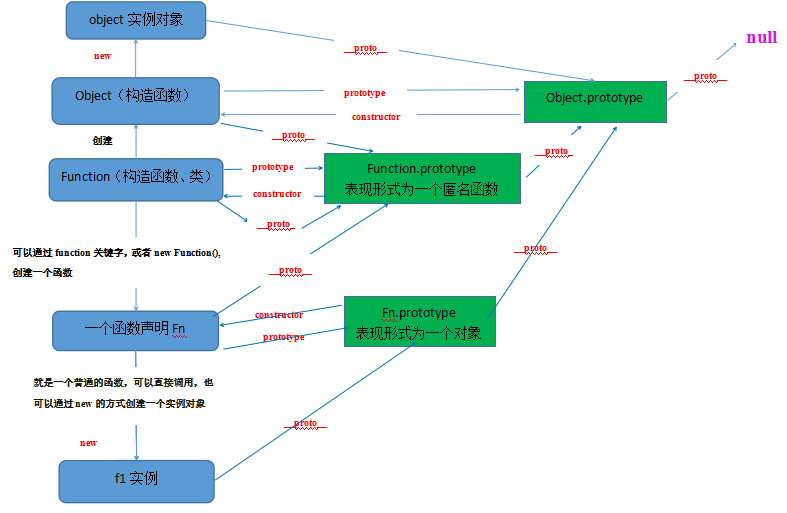

# 理解对象
- 对象就是：无序属性的集合，其属性值为：基本类型、对象或函数。
- 其实对象就是一组无序的值，只不过通过属性和方法映射到指定的值。
## ECMA对象中的两种属性
- 既然对象是由属性构成的。
- 那么在ECMA5中就有两种属性：
1. 数据属性
2. 访问器属性.
- 这两个属性，都是为JS引擎而定义的，我们不能再js中调用它们。为了表示 它们的特殊性，所以[[]]表示。
- 注意：如果对象的属性是直接在定义的，那么默认的特性为true；如果用Object.defineProperty()方法，没有设置的特性为false。

- 注意：
- 需要注意，如果设置对象上一个属性的数据属性，就直接写就可以了。
- 如果设置对象上一个属性的访问器属性，那么需要在定义这个属性的时候必须加 _ ,同时在设置其数据特性和访问器特性时都要加上 _ ,这是访问器属性不包含数据值。
- 如果需要修改设置了访问器属性的对象属性，那么还是修改对象的数据属性，所以不加 _
### 数据属性
- 数据属性包含了一个数据值的位置。在这个位置可以读取和写入值。数据属性有4个描述其行为的特性。
- 注意：数据的特性是首字母小写.
#### [[configurable]]
- [[configurable]]：表示能否通过 delete 删除属性而从重新定义属性，能否把数据属性修改为访问器属性。如果直接在对象上定义的属性，默认是true。
- 注意：一旦对象的configurable特性，被Object.defineProperty()方法修改为false，那么就不能再被修改为true。
~~~
var mm = {
    name: 'hggf'
};
Object.defineProperty(mm,'name',{
    configurable: false,
})
//会抛出错误
Object.defineProperty(mm,'name',{
    configurable: true,
})
~~~
#### [[enumerable]]
- [[Enumerable]]:表示能否通过 for-in 循环返回属性。如果直接在对象上定义的属性，默认是true
#### [[writable]]
- [[writable]]:表示能否修改属性值。如果直接在对象上定义的属性，默认是true	
#### [[value]]
- [[Value]]：包含这个属性的数据值。读取属性时从这个位置读，写入属性时把新值保存到这个位置。其默认值是 undefined。
  如果直接在对象上定义的属性：
~~~
var ss = {
    name: '张杨'
};
~~~
- 那么其他三个特性都是 true，只有[[Value]]特性的值是我指定的。 
#### Object.defineProperty()

- Object.defineProperty作用就是直接在一个对象上定义一个新属性，或者修改一个已经存在的属性

- 在ECMA5中，提供了一个可以修改对象 数据属性的方法:Object.defineProperty().
- 该方法会直接在一个对象上定义一个新属性，或者修改一个对象的现有属性， 并返回这个对象
   该方法需要结束三个参数：属性所在的对象，属性名字，描述符对象（键值对）。
- 注意：其中描述符对象是一个{},里面的属性必须是
- Configurable、Enumerable、Writable、Value。可以设置一个或多个值，修改其对应的特性值。
~~~
{
	Configurable： true or false，
	Enumerable： true or false，
	Writable： true or false，	
	Value：自己指定的值
}
~~~
- 举例
~~~
var ss = {
    name: 'ppp'
};
Object.defineProperty(ss,"name",{
//把对象的属性的 数据属性 的writable特性，进行了修改，设为fasle。
   writable: false, 
//把对象的属性的 数据属性 的value特性，进行了修改，设为自己指定的值。 
   value: 'yyy'     
});

//这个对象的name属性的 数据属性 的writable特性，设置为只读模式。
console.log(ss.name); //yyy
//尝试修改只读特性的属性，在严格模式下是会出错的，在非严格模式下会忽略的 该赋值操作。
ss,name = 'zzz';   
console.log(ss.name);   //yyy
~~~

### 访问器属性
- 访问器属性不包含数据值，访问器属性有如下4个特性：访问器属性以下划线开头，表示只能是对象方法访问的。
#### [[Configurable]]
- 与数据属性的[[Configurable]] 相同。
#### [[Enumerable]]
#### [[Get]]
- 在读取属性时的调用函数。默认值为undefined。方法执行时没有参数传入，但是会传入this对象（由于继承关系，这里的this并不一定是定义该属性的对象）。
#### [[Set]]
- 在设置属性时的调用函数。默认值为undefined。方法执行时没有参数传入，但是会传入this对象（由于继承关系，这里的this并不一定是定义该属性的对象）。
#### 使用访问器属性的常用方法
- 通用使用Object.defineProperty()来定义访问器属性的特性。
- 使用访问器属性的常见方法，即设置一个属性的值会导致其他属性发生变化。
~~~
------------
 //定义对象的 year 属性 的访问器属性 的特性。
 //注意数据属性 和 访问器属性，不是同一个东西。
 //数据属性 里面是值，与对象的属性的名称相同。
 //对象属性名，是需要写在 Object.defineProperty () 方法里，
 //然后通过其特性 进行设置。
var book = {
    _year:2018,
    edition:4
};
Object.defineProperty(book,'year',{  
    //读取属性时调用的函数
    get: function () {
        return this._year;       
    },
    //设置属性时调用的属性。
    set: function(newValue) {
        if (newValue > 2018) {
            this._year = newValue;
            this.edition += newValue - this._year;    //edition 属性也被修改了。
        }
    }
}); 
    book.year = 2020;
 console.log(book.year);
~~~
#### 对象中get和set的实现方式
- 除了上述方法还可以直接在对象中实现
~~~
var obj1 = {
        name: 'shaanxi',
        get nameGet() {
            return this.name + 'a';
        },
        set nameSet(name) {
            this.name = name;
        }
    };
    console.info(obj1.nameGet);  //shaanxia
    obj1.nameSet = 'set by set keywords';  
    console.info(obj1.nameGet);  //set by set keywordsa
~~~
- 还可以使用原型方法进行设置
~~~
var obj2 = {
        name: 'shaanxi'
    };

    obj2.__defineGetter__('nameGet', function() {
        return this.name;
    });
    obj2.__defineSetter__('nameSet', function(
        name) {
        this.name = name;
    });
    var ref1 = obj2.__lookupGetter__('nameGet');
    var ref2 = obj2.__lookupSetter__('nameSet');
    console.info(obj2.nameGet);  //shaanxi
    obj2.nameSet = 'set by __defineSetter__';
    console.info(obj2.nameGet);  //set by __defineSetter__
~~~
### 存疑
- ECAM5,我们可以通过Object.getOwnPropertyDescriptor() 获得对象的属性的特性描述符。需要两个参数：
1. 需要获得属性描述符所在的对象。
2. 字符串形式的属性名。
  console.log(Object.getOwnPropertyDescriptor(book,"_year"));
### 定义多个属性
- 当一个函数需要定义多个属性的特性时。可以使用：Object.defineProperties();  
- 该方法直接在一个对象上定义一个或多个新的属性或修改现有属性，并返回该对象。
~~~
 //第一个参数 要添加和修改属性的对象，第二个参数对象的属性与第一个参数中要修改的属性一一对应。
//用面向字面量的方式创建一个book对象
var book={_year:2000,edition:0};
//调用Object.defineProperties(对象名，要添加的属性)方法，为对象一次定义多个属性(1.数据属性)(2.访问器属性)
Object.defineProperties(book,{
//添加的两个数据属性(_year,edition)
_year:{//(_year)前面的下划线表示只能通过对象方法访问的属性
value:2004, 
},
edition:{
value:1,
},
//添加了访问器属性(year)
year:{
//调用get方法读取属性
get:function(){
return this._year;
},
//调用set方法写入属性
set:function(newValue){
if (newValue>2004) {
this._year=newValue;
this.edition+=(newValue-2004);
}
}
}
});
console.log(book.year);  //2004
console.log(book._year);  //2004
//测试
book.year=2008;//访问器属性常见方式，设置一个属性的值会导致其他属性发生变化
console.log(book.year);   //2008
console.log(book.edition);  //5
);   
book.year = 2020;
console.log(book.year); //2020
~~~
#### 注意事项
- 需要注意，如果设置对象上一个属性的数据属性，就直接写就可以了。
- 如果设置对象上一个属性的访问器属性，那么需要在定义这个属性的时候必须加 _ ,同时在设置其数据特性和访问器特性时都要加上 _ ,
- 这因为访问器属性不包含数据值。var book={_year:2000,edition:0};
~~~
//调用Object.defineProperties(对象名，要添加的属性)方法，为对象一次定义多个属性(1.数据属性)(2.访问器属性)
Object.defineProperties(book,{
//添加的两个数据属性(_year,edition)
_year:{//(_year)前面的下划线表示只能通过对象方法访问的属性
value:2004,
},
edition:{
value:1,
},
//添加了访问器属性(year)
year:{
//调用get方法读取属性
get:function(){
return this._year;
},
//调用set方法写入属性
set:function(newValue){
if (newValue>2004) {
this._year=newValue;
this.edition+=(newValue-2004);
}
}
}
});
console.log(book.year); //2004
console.log(book._year); //2004
//测试
注意：修改属性的值还是需要修改数据属性
修改访问器属性的数据属性时，不要加 _
book.year=2008;//访问器属性常见方式，设置一个属性的值会导致其他属性发生变化
console.log(book.year); //2008
console.log(book.edition); //5
~~~
## 工厂模式
- 工厂模式：避免了多次使用同一个Object类型的接口，造成大量的代码浪费。
- 工厂函数 创建多个对象
~~~
function createHero(name, blood, weapon) {
      var o = new Object();
      o.name = name;
      o.blood = blood;
      o.weapon = weapon;
      o.attack = function () {
        console.log(this.weapon + ' 攻击敌人');
      }
      return o;
    }
var  hero = createHero('刘备', 100, '剑');
 var  hero1 = createHero('关羽', 100, '刀');
~~~
- 无法具体判断 对象的具体类型。
- 更优雅的工厂模式：构造函数，可以判断对象的具体类型。
### 构造函数的问题与特点
#### 构造函数的特点
- 特点：每次创建一个构造函数实例时，都会给这个实例中创建name、age、job等属性（未赋值）， 然后根据构造函数实例里面的参数进行赋值。
- 问题;每个构造函数实例中的方法实例，不是同一个函数实例。
~~~
function Preson (name, age, job) {
         this.name = name;
         this.age = age;
         this.job = job;
         Preson.prototype.sayName = function () {
             console.log(this.name);
             
         }
     }
 var preson1 = new Preson('AAA',18,'doctor');
 var preson2 = new Preson('AAA', 29, 'teacher');
 // 创建了两个 构造函数实例。
 //问题1：这两个构造函数的方法是否相同。
 // 函数名就是指针，通过函数 名可以判断是否为同一个函数实例。
 //console.log(preson1.sayName == preson2.sayName);
 //通过获得构造函数实例的原型对象，可以知道构造函数里面的name属性，并没有添加到原型里。
 //console.log(Object.getPrototypeOf(preson1).name);
 //name属性，存在构造函数的实例中。
 // console.log(preson1.name);
~~~
#### 构造函数的使用方法详解
~~~
function ss () {
       this.si = function() {
           alert('hi');
       }
   }
//把构造函数，当作对象使用。
   var cc = new ss();
   cc.si();
   //把构造函数当作普通对象使用。
   ss(); //作为普通函数调用，把ss添加到window对象里面
  window.si();
  //在另一个对象的作用域调用
  var mm = new ss();
  ss.call(mm);  //把构造函数在指定的作用域运行。
  mm.si();
~~~
## 原型属性

### JS中原型图

- 普通构造函数：
~~~
 function Preson (name, age, job) {
            this.name = name;
            this.age = age;
            this.job = job;
            Preson.prototype.sayName = function () {
                console.log(this.name);
            }
        }
    var preson1 = new Preson('AAA',18,'doctor');
    var preson2 = new Preson('AAA', 29, 'teacher');
~~~
- 基于原型的构造函数：
~~~
 function Preson () {  
    Preson.prototype.name = 'AAA';
    Preson.prototype.age = 18;
    Preson.prototype.job = 'doctor';
    Preson.prototype.sayName = function () {
        console.log(this.name);
        
    }
}
var preson1 = new Preson();
var preson2 = new Preson();
~~~
- 注意：构造函数和 Object都是 Function创建出来的
### 原型的定义
- 原型的定义
- 每创建一个构造函数实例都有一个 [[prototype]] 属性，该属性的值是一个指针，指向一个对象。
- 这个对象，包含一个constructor属性，指向构造函数，同时这个原型对象还可以继承Object的属性和方法。
~~~
console.log(Preson.prototype.valueOf());
可以查看构造函数原型的内容。
{sayName: ƒ, constructor: ƒ}，
可以看出构造函数是一个对象，里面有constructor方法 和 sayName方法。
~~~
### 原型的作用
- 原型的作用：包含可以由特定类型（构造函数）的所有实例共享的属性和方法。
### 构造函数 与构造函数原型 与构造函数实例的关系
- 构造函数 与 构造函数原型 与 构造函数实例的关系。
- 创建一个构造函数，里面有prototyp属性，指向构造函数原型。
- 构造函数原型有一个constructor属性指向构造函数。
- 每一个构造函数实例：都有一个隐藏的[[prototype]]属性，指向构造函数原型。
- **也就是说构造函数实例 与构造函数没有任何关系。**
#### 查看构造函数实例的内部指针[[prototype]]
- 每个构造函数实例都有一个隐藏的[[prototype]]属性。我们可以通过 isPrototypeOf 方法，判断构造函数实例与构造函数原型是否有这种情况，如果有返回true。
   console.log(Preson.prototype.isPrototypeOf(preson1));      //true
- 在ECAM5中还可以用Object.getPrototypeOf方法，得到构造函数实例的原型对象。
  console.log(Object.getPrototypeOf(preson1));
#### 获得实例的原型的方法Object.getPrototypeOf()
- 该方法是Object 类 里面的一个方法该方法需要一个参数。需要获得原型的那个实例。
#### 判断构造函数的原型与构造函数的实例有无关系
- isPrototypeOf 方法，判断构造函数实例与构造函数原型是否有关联，如果有返回true。
- 该方法属性原型里面的一个方法.
1. 首先需要知道 需要判断的原型。
2. 参数是判断的构造函数实例。
- 语法格式：Preson.prototype.isPrototypeOf(preson1)
### 访问某个对象的某个属性的流程
1. 访问某个对象的某个属性时：
- 如访问构造函数实例preson1的naem属性，
- 首先在构造函数中的实例中寻找name属性，如果有返回，没有去原型里面找name属性
### 基于原型的构造函数特点
- 基于原型的构造函数特点
1. 把属性如name和方法（sayName）都存到构造函数的原型里面。
2. 可以通过实例访问原型里面的数据，但是不能通过实例重写原型里面的数据。
3. 因为原型里面的数据是共享的，供所有实例访问，一旦修改所有的实例都会受到影响.
~~~
function Preson (ss) {
        // Preson.prototype.name = ss;
        Preson.prototype.name = 'AAA';
         Preson.prototype.age = 18;
         Preson.prototype.job = 'doctor';
         Preson.prototype.sayName = function () {
             console.log(this.name);
             
         }
     }
 var preson1 = new Preson();
 var preson2 = new Preson();
 var preson3 = new Preson('BB');
 
 
 console.log(preson1.name);  // AAA 来源于原型。
 console.log(preson2.name);   // AAA 来源于原型
 //console.log(preson3.name);   //所有的实例的name属性都变成了BB
 
 //我们可以给函数的实例中创建 与 原型中名称相同的属性，从而切除与原型的关系。
 preson1.name = 'BBB';
 console.log(preson1.name);  //来源于实例preson1
~~~
#### delete操作符
- 我们可以通过delete操作符，删除实例中的属性，从而恢复与原型的关系。
~~~
function Preson () {
   
    Preson.prototype.name = 'AAA';
    Preson.prototype.age = 18;
    Preson.prototype.job = 'doctor';
    Preson.prototype.sayName = function () {
        console.log(this.name);
        
    }
}
var preson1 = new Preson();
var preson2 = new Preson();
preson1.name = 'BBB';
console.log(preson1.name);  //  BBB 来源于实 例preson1
delete preson1.name; 
console.log(preson1.name);  // AAA 来源于原型
~~~
#### hasOwnProperty()
- 我们可以通过hasOwnProperty方法，来确定属性是来自实例还是来自原型，如果来自实例访问true，来自原型返回false。
  console.log(preson1.hasOwnProperty(name));  //false   name属性来源于实例。
#### in操作符的单独使用
- 我们可以单独使用in操作符，来访问对象属性，无论是来源于原型还是实例都返回true。
  console.log('name' in preson1); 
#### 配合使用hasOwnProperty和 in
- 我们可以配合使用hasOwnProperty和 in 来判断对象的属性来源是否是原型。
~~~
function has (object,name) {
        return !object.hasOwnProperty(name) && (name in object);
}
//分析：(name in object) 保证需要判断的属性和对象是存在的。
//!object.hasOwnProperty(name)，如果来源于实例，取反为false，如果来源于原型例，取反为true。
~~~
### 获得实例对象或原型上的属性
- 这两个方法有兼容性问题：IE9+ Firefox4+ Safari5+ Opera Chrome
#### 获得可枚举的实例属性Object.keys()
~~~
function Preson (ss) {
         // Preson.prototype.name = ss;
         Preson.prototype.name = 'AAA';
          Preson.prototype.age = 18;
          Preson.prototype.job = 'doctor';
          Preson.prototype.sayName = function () {
              console.log(this.name);
              
          }
      }
  var preson1 = new Preson();
  var preson2 = new Preson();
  preson1.name = 'BBB';
  preson1.age = 20;
  //在ECMA5中可以使用， Object.keys()方法。
  //该方法接收一个对象作为参数，返回一个包含所有可枚举的实例属性的字符串数组。
  console.log(Object.keys(Preson.prototype));
  console.log(Object.keys(preson1));
~~~
#### 获得所有的实例属性Object.getOwnPropertyNames()
- 使用Object.getOwnPropertyNames()方法，可以获得所有的实例属性（无论是否可枚举）
~~~
console.log(Object.getOwnPropertyNames(Preson.prototype));
["constructor", "name", "age", "job", "sayName"]
~~~
### 简化基于原型构造函数的语法（重写原型）
~~~
//避免每次添加属性，都要写 Preson.prototype
        function Preson () {
        }

         Preson.prototype = {
           name: 'AAA',
            age:  18,
            job: 'doctor',
            sayName: function () {
                console.log(this.name);
             }
          };
   //简化语法的特点：原型中的constructor不再指向Person了。   
  console.log(Preson.prototype.constructor);
  //现在指向的Object 构造函数。
-----------------------------------------
//如果constructor很重要，我们可以设置constructor的值。
  function Preson () {
        }

         Preson.prototype = {
            constructor: Preson,
           name: 'AAA',
            age:  18,
            job: 'doctor',
            sayName: function () {
                console.log(this.name);
             }
          };
  //这样做的就会导致 constructor属性里面的 [[Enumerable]]特性被设置为true。
  //就变成可枚举的，而原生的是不可枚举的。
~~~
### 原型的动态性
- 即访共享原型属性的所有实例，如果原型一旦修改，那么所有的实例都会被修改，无论是在原型修改前创建的函数。
~~~
function Person() {};
  var friend = new Person();
  Person.prototype.siHi = function () {
      console.log('hi');
      
  };
 friend.siHi();
~~~
### 重写原型的影响
~~~
//重写原型对象，就是以Preson.prototype = {}的形式，
//相当于开辟了一个新的原型对象。
//而构造函数的实例，里面原生的[[prototype]] 任然指向 旧的原型对象。
//在重写原型之前的实例任然指向旧的原型对象，
在重写原型之后 的实例则指向新的原型对象。
function Preson () {
 }
 var ff = new Preson();
  Preson.prototype = {
     constructor: Preson,
    name: 'AAA',
     age:  18,
     job: 'doctor',
     sayName: function () {
         console.log(this.name);
      }
   };
ff.sayName();   // 错误，sayName不是一个函数。
~~~
### 原生对象的原型
- 不仅我们自定义的构造函数，有原型的概念。即使是原生的对象类型（Oblect、String、Array）等，都在其构造函数的原型上，定义的方法。
~~~
//console.log(Array.prototype); 
  console.log(Array.prototype.sort);   // ƒ sort() { [native code] }
  console.log(typeof Array.prototype.sort);  //function
~~~
#### 修改原生对象原型的影响
- 我们可以获取和访问 所有原生对象的原型中的方法，当然我们可以修改它们。
~~~
String.prototype.switc = function (text) {
    return this.indexOf(text) == 0;
}
var mm = 'Hello wolrd'
console.log(mm.switc('Hello'));
//尽量不要在产品化的程序中，修改原生对象的原型。
~~~
#### 原型对象的问题
- 原型对象的问题：原型问题在于共享，我们在工作中基本上希望实例有自己的属性。所以我们很少单独使用原型模式。
### 组合使用构造函数和静态原型模式
- 组合使用构造函数和原型模式
- 首先在构造函数模式，用来定义实例属性。
- 原型里面放用于共享的方法和属性。
- 好处：每个实例都有自己的属性副本，同时又共享着原型的引用，既节省内存，又可以给构造函数传递参数修改实例属性。
~~~
function Person (name, age, job) {
    this.name = name;
    this.age = age;
    this.job = job;
    this.friend = ['aa','bb'];
}
Person.prototype = {   //重写部分原型对象
    constructor: Person,
    sayName: function () {
        console.log(this.name);
        
    }
};
var person1 = new Person('ZY',18,'SOFTENGINEER');
var person2 = new Person('SKL',20,'DOCTOR');
    person1.friend.push('ooo');
    console.log(person1.friend);
    console.log(person2.friend);
    console.log(person1.friend == person2.friend);
    console.log(person1.sayName == person2.sayName);
~~~
#### 动态的原型模式
- 因为原型里面存放的是共享的方法和属性，所以我们可以动态的检测构造函数实例中是否有享原型的方法。
~~~
function Person (name, age, job) {
       this.name = name;
       this.age = age;
       this.job = job;
   
   if ( typeof this.sayName != 'function' ) {
       Person.prototype.sayName =  	function () {
          console.log(this.name); 
       };
     }
   }
~~~
- 我们检测构造函数中是否存在sayName()方法，如果不存在我们将其添加到原型中。
- 什么静态原型：使用字面量重写原型，之后不再修改。
- 动态原型：随时判断实时中的原型是否存在指定的方法，如果不存在随时修改，所以我们不能使用{}来重写原型。
- 注意：我们在修改原型属性时，如果是静态的修改我们可以使用字面量（{}），如果是动态的我们不能使用字面量形式，防止切断现有实例与新原型的关系。
### 寄生构造函数
- 就是函数里面包含一个对象，然后返回对象。简单了解
### 稳妥构造函数模式
- 稳妥函数多用于比较安全的环境。所谓稳妥，就是里面的数据很安全。简单了解。
