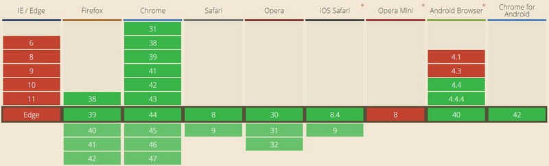

# WebSocket
## 什么是WebSocket
- WebSocket 是 HTML5 开始提供的一种在单个 TCP 连接上进行全双工通讯的协议。
- WebSocket 使得客户端和服务器之间的数据交换变得更加简单，允许服务端主动向客户端推送数据。在 WebSocket API 中，浏览器和服务器**只需要完成一次握手**，两者之间就直接可以创建持久性的连接，并进行双向数据传输。
- 在 WebSocket API 中，浏览器和服务器只需要做一个握手的动作，然后，浏览器和服务器之间就形成了一条快速通道。两者之间就直接可以数据互相传送。
- 现在，**很多网站为了实现推送技术**，**所用的技术都是 Ajax 轮询**。轮询是在特定的的时间间隔（如每1秒），由浏览器对服务器发出HTTP请求，然后由服务器返回最新的数据给客户端的浏览器。这种传统的模式带来很明显的缺点，即浏览器需要不断的向服务器发出请求，然而HTTP请求可能包含较长的头部，其中真正有效的数据可能只是很小的一部分，显然这样会浪费很多的带宽等资源。
- HTML5 定义的 WebSocket 协议，能更好的节省服务器资源和带宽，并且能够更实时地进行通讯。
- 浏览器通过 JavaScript 向服务器发出建立 WebSocket 连接的请求，连接建立以后，客户端和服务器端就可以通过 TCP 连接直接交换数据。
  当你获取 Web Socket 连接后，你可以**通过 send() 方法来向服务器发送数据**，并**通过 onmessage 事件来接收服务器返回的数据**。
### 如何创建 WebSocket 对象
- var Socket = new WebSocket(url, [protocol] );
- 参数：第一个参数 url, 指定连接的 URL。第二个参数 protocol 是可选的，指定了可接受的子协议。
### WebSocket 对象的属性
- 假定我们使用了以上代码创建了 Socket 对象：
#### Socket.readyState
- 只读属性 readyState 表示连接状态：
- 0 - 表示连接尚未建立。
- 1 - 表示连接已建立，可以进行通信。
- 2 - 表示连接正在进行关闭。
- 3 - 表示连接已经关闭或者连接不能打开。
#### Socket.bufferedAmount
- 只读属性 bufferedAmount 已被 send() 放入正在队列中等待传输，但是还没有发出的 UTF-8 文本字节数。
### WebSocket 对象相关事件
- 以下是 WebSocket 对象的相关事件。假定我们使用了以上代码创建了 Socket 对象：
#### open
- Socket.onopen：连接建立时触发
  #### message
- Socket.onmessage： 客户端接收服务端数据时触发
#### error
- Socket.onerror：通信发生错误时触发
#### close
- Socket.onclose： 连接关闭时触发
### WebSocket 方法
- 以下是 WebSocket 对象的相关方法。假定我们使用了以上代码创建了 Socket 对象：
#### Socket.send() 使用连接发送数据
#### Socket.close() 关闭连接
### 分析WebSocket 实例
- WebSocket 协议本质上是一个基于 TCP 的协议。
- 为了建立一个 WebSocket 连接，客户端浏览器首先要向服务器发起一个 HTTP 请求，这个请求和通常的 HTTP 请求不同，包含了一些附加头信息，其中附加头信息"Upgrade: WebSocket"表明这是一个申请协议升级的 HTTP 请求，服务器端解析这些附加的头信息然后产生应答信息返回给客户端，客户端和服务器端的 WebSocket 连接就建立起来了，双方就可以通过这个连接通道自由的传递信息，并且这个连接会持续存在直到客户端或者服务器端的某一方主动的关闭连接。
### 兼容性
- WebSocket 协议在2008年诞生，2011年成为国际标准。所有浏览器都已经支持了
### 支持 WebSocket 的服务
- 我们在使用WebSocket接口时，需要创建一个支持 WebSocket 的**服务**。
- 从 pywebsocket 下载 mod_pywebsocket ,或者使用 git 命令下载：
~~~
git clone https://github.com/google/pywebsocket.git
~~~
- mod_pywebsocket 需要 **python 环境**支持
- mod_pywebsocket 是一个 Apache HTTP 的 Web Socket扩展，安装步骤如下：
- 解压下载的文件。
- 进入 pywebsocket 目录。
- 执行命令：
~~~
$ python setup.py build
$ sudo python setup.py install
~~~
- 查看文档说明:
~~~
$ pydoc mod_pywebsocket
~~~
- 开启服务
- 在 pywebsocket/mod_pywebsocket 目录下执行以下命令：
~~~
$ sudo python standalone.py -p 9998 -w ../example/
~~~
- 以上命令会开启一个端口号为 9998 的服务，使用 -w 来设置处理程序 echo_wsh.py 所在的目录。
  现在我们可以在 Chrome 浏览器打开前面创建的 runoob_websocket.html 文件。
## WebSocket 出现前
- 构建网络应用的过程中，我们经常需要与服务器进行持续的通讯以保持双方信息的同步。通常这种持久通讯在不刷新页面的情况下进行，消耗一定的内存资源常驻后台，并且对于用户不可见。在 WebSocket 出现之前，我们有以下解决方案：
### 传统轮询(Traditional Polling)
当前Web应用中较常见的一种持续通信方式，通常采取 setInterval 或者 setTimeout 实现。例如如果我们想要定时获取并刷新页面上的数据，可以结合Ajax写出如下实现：
~~~
setInterval(function() {
    $.get("/path/to/server", function(data, status) {
        console.log(data);
    });
}, 10000);
~~~
- 上面的程序会每隔10秒向服务器请求一次数据，并在数据到达后存储。这个实现方法通常可以满足简单的需求，然而同时也存在着很大的缺陷：在网络情况不稳定的情况下，服务器从接收请求、发送请求到客户端接收请求的总时间有可能超过10秒，而请求是以10秒间隔发送的，这样会导致接收的数据到达先后顺序与发送顺序不一致。于是出现了采用 setTimeout 的轮询方式：
~~~
function poll() {
    setTimeout(function() {
        $.get("/path/to/server", function(data, status) {
            console.log(data);
            // 发起下一次请求
            poll();
        });
    }, 10000);
}
~~~
- 程序首先设置10秒后发起请求，当数据返回后再隔10秒发起第二次请求，以此类推。这样的话虽然无法保证两次请求之间的时间间隔为固定值，但是可以保证到达数据的顺序。
### 长轮询(Long Polling)
- 上面两种传统的轮询方式都存在一个严重缺陷：程序在每次请求时都会新建一个HTTP请求，然而并不是每次都能返回所需的新数据。当同时发起的请求达到一定数目时，会对服务器造成较大负担。这时我们可以采用长轮询方式解决这个问题。
- 长轮询与以下将要提到的服务器发送事件和WebSocket不能仅仅依靠客户端JavaScript实现，我们同时需要服务器支持并实现相应的技术。
- 长轮询的基本思想是在每次客户端发出请求后，服务器检查上次返回的数据与此次请求时的数据之间是否有更新，如果有更新则返回新数据并结束此次连接，否则服务器 **hold 住此次连接，直到有新数据时再返回相应**。而这种长时间的保持连接可以通过设置一个较大的 HTTP timeout` 实现。下面是一个简单的长连接示例：
- 服务器（PHP）：
~~~
<?php
    // 示例数据为data.txt
    $filename= dirname(__FILE__)."/data.txt";
    // 从请求参数中获取上次请求到的数据的时间戳
    $lastmodif = isset( $_GET["timestamp"])? $_GET["timestamp"]: 0 ;
    // 将文件的最后一次修改时间作为当前数据的时间戳
    $currentmodif = filemtime($filename);

    // 当上次请求到的数据的时间戳*不旧于*当前文件的时间戳，使用循环"hold"住当前连接，并不断获取文件的修改时间
    while ($currentmodif <= $lastmodif) {
        // 每次刷新文件信息的时间间隔为10秒
        usleep(10000);
        // 清除文件信息缓存，保证每次获取的修改时间都是最新的修改时间
        clearstatcache();
        $currentmodif = filemtime($filename);
    }

    // 返回数据和最新的时间戳，结束此次连接
    $response = array();
    $response["msg"] =Date("h:i:s")." ".file_get_contents($filename);
    $response["timestamp"]= $currentmodif;
    echo json_encode($response);
?>
~~~
- 客户端：
~~~
function longPoll (timestamp) {
    var _timestamp;
    $.get("/path/to/server?timestamp=" + timestamp)
    .done(function(res) {
        try {
            var data = JSON.parse(res);
            console.log(data.msg);
            _timestamp = data.timestamp;
        } catch (e) {}
    })
    .always(function() {
        setTimeout(function() {
            longPoll(_timestamp || Date.now()/1000);
        }, 10000);
    });
}
~~~
- 长轮询可以有效地解决传统轮询带来的带宽浪费，但是每次连接的保持是以消耗服务器资源为代价的。尤其对于Apache+PHP 服务器，由于有默认的 worker threads 数目的限制，当长连接较多时，服务器便无法对新请求进行相应。
### 服务器发送事件(Server-Sent Event)
- 服务器发送事件（以下简称SSE）是HTML 5规范的一个组成部分，可以实现服务器到客户端的单向数据通信。通过 SSE ，客户端可以自动获取数据更新，而不用重复发送HTTP请求。一旦连接建立，“事件”便会自动被推送到客户端。服务器端SSE通过 事件流(Event Stream) 的格式产生并推送事件。事件流对应的 MIME类型 为 text/event-stream ，包含四个字段：event、data、id和retry。event表示事件类型，data表示消息内容，id用于设置客户端 EventSource 对象的 last event ID string 内部属性，retry指定了重新连接的时间。
- 服务器（PHP）：
~~~
<?php
    header("Content-Type: text/event-stream");
    header("Cache-Control: no-cache");
    // 每隔1秒发送一次服务器的当前时间
    while (1) {
        $time = date("r");
        echo "event: ping\n";
        echo "data: The server time is: {$time}\n\n";
        ob_flush();
        flush();
        sleep(1);
    }
?>
~~~
- 客户端中，SSE借由 EventSource 对象实现。EventSource 包含五个外部属性：onerror, onmessage, onopen, readyState、url，以及两个内部属性：reconnection time与 last event ID string。在onerror属性中我们可以对错误捕获和处理，而 onmessage 则对应着服务器事件的接收和处理。另外也可以使用 addEventListener 方法来监听服务器发送事件，根据event字段区分处理。
- 客户端：
~~~
var eventSource = new EventSource("/path/to/server");
eventSource.onmessage = function (e) {
    console.log(e.event, e.data);
}
// 或者
eventSource.addEventListener("ping", function(e) {
    console.log(e.event, e.data);
}, false);
~~~
- SSE相较于轮询具有较好的实时性，使用方法也非常简便。然而**SSE只支持服务器到客户端单向的事件推送**，而且所有版本的IE（包括到目前为止的Microsoft Edge）都不支持SSE。如果需要强行支持IE和部分移动端浏览器，可以尝试 EventSource Polyfill（本质上仍然是轮询）。SSE的浏览器支持情况如下图所示：

