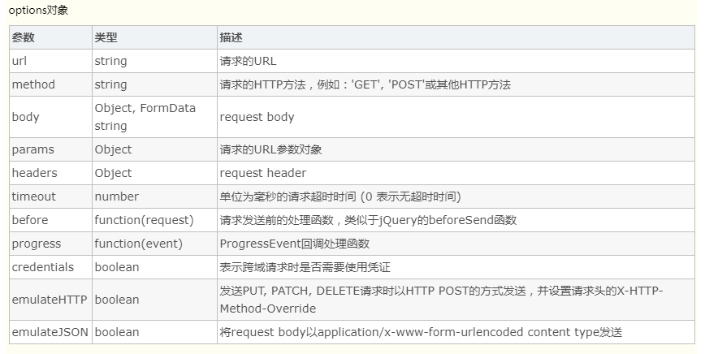

## vue-resource

- Vue.js是数据驱动的，这使得我们并不需要直接操作DOM，如果我们不需要使用jQuery的DOM选择器，就没有必要引入jQuery。vue-resource是Vue.js的一款插件，它可以通过XMLHttpRequest或JSONP发起请求并处理响应。也就是说，$.ajax能做的事情，vue-resource插件一样也能做到，而且vue-resource的API更为简洁。另外，vue-resource还提供了非常有用的inteceptor功能，使用inteceptor可以在请求前和请求后附加一些行为，比如使用inteceptor在ajax请求时显示loading界面。
### vue-resource特点：
- vue-resource插件具有以下特点：

1. 体积小
   vue-resource非常小巧，在压缩以后只有大约12KB，服务端启用gzip压缩后只有4.5KB大小，这远比jQuery的体积要小得多。
2. 支持主流的浏览器
   和Vue.js一样，vue-resource除了不支持IE 9以下的浏览器，其他主流的浏览器都支持。
3. 支持Promise API和URI Templates
   Promise是ES6的特性，Promise的中文含义为“先知”，Promise对象用于异步计算。
   URI Templates表示URI模板，有些类似于ASP.NET MVC的路由模板。
4. 支持拦截器
   拦截器是全局的，拦截器可以在请求发送前和发送请求后做一些处理。
   拦截器在一些场景下会非常有用，比如请求发送前在headers中设置access_token，或者在请求失败时，提供共通的处理方式。
### 之前回顾
1. 之前的学习中，如何发起数据请求？
2. 常见的数据请求类型？  get  post jsonp
3. 测试的URL请求资源地址：

- get请求地址： http://vue.studyit.io/api/getlunbo
- post请求地址：http://vue.studyit.io/api/post
- jsonp请求地址：http://vue.studyit.io/api/jsonp

1. JSONP的实现原理

- 由于浏览器的安全性限制，不允许AJAX访问 协议不同、域名不同、端口号不同的 数据接口，浏览器认为这种访问不安全；
- 可以通过动态创建script标签的形式，把script标签的src属性，指向数据接口的地址，因为script标签不存在跨域限制，这种数据获取方式，称作JSONP（注意：根据JSONP的实现原理，知晓，JSONP只支持Get请求）；
- 具体实现过程：
  - 先在客户端定义一个回调方法，预定义对数据的操作；
  - 再把这个回调方法的名称，通过URL传参的形式，提交到服务器的数据接口；
  - 服务器数据接口组织好要发送给客户端的数据，再拿着客户端传递过来的回调方法名称，拼接出一个调用这个方法的字符串，发送给客户端去解析执行；
  - 客户端拿到服务器返回的字符串之后，当作Script脚本去解析执行，这样就能够拿到JSONP的数据了；
- 带大家通过 Node.js ，来手动实现一个JSONP的请求例子；

```
    const http = require('http');
    // 导入解析 URL 地址的核心模块
    const urlModule = require('url');

    const server = http.createServer();
    // 监听 服务器的 request 请求事件，处理每个请求
    server.on('request', (req, res) => {
      const url = req.url;

      // 解析客户端请求的URL地址
      var info = urlModule.parse(url, true);

      // 如果请求的 URL 地址是 /getjsonp ，则表示要获取JSONP类型的数据
      if (info.pathname === '/getjsonp') {
        // 获取客户端指定的回调函数的名称
        var cbName = info.query.callback;
        // 手动拼接要返回给客户端的数据对象
        var data = {
          name: 'zs',
          age: 22,
          gender: '男',
          hobby: ['吃饭', '睡觉', '运动']
        }
        // 拼接出一个方法的调用，在调用这个方法的时候，把要发送给客户端的数据，序列化为字符串，作为参数传递给这个调用的方法：
        var result = `${cbName}(${JSON.stringify(data)})`;
        // 将拼接好的方法的调用，返回给客户端去解析执行
        res.end(result);
      } else {
        res.end('404');
      }
    });

    server.listen(3000, () => {
      console.log('server running at http://127.0.0.1:3000');
    });
```
### 如何使用vue-resource
1. vue-resource 的配置步骤：
- 直接在页面中，通过`script`标签，引入 `vue-resource` 的脚本文件；
- 注意：引用的先后顺序是：先引用 `Vue` 的脚本文件，再引用 `vue-resource` 的脚本文件；
- 引入vue-resource后，可以基于全局的Vue对象使用http，也可以基于某个Vue实例使用http。
~~~
// 基于全局Vue对象使用http
Vue.http.get('/someUrl', [options]).then(successCallback, errorCallback);
Vue.http.post('/someUrl', [body], [options]).then(successCallback, errorCallback);
 
// 在一个Vue实例内使用$http
this.$http.get('/someUrl', [options]).then(successCallback, errorCallback);
this.$http.post('/someUrl', [body], [options]).then(successCallback, errorCallback);
~~~
- 在发送请求后，使用then方法来处理响应结果，then方法有两个参数，第一个参数是响应成功时的回调函数，第二个参数是响应失败时的回调函数。
  then方法的回调函数也有两种写法，第一种是传统的函数写法，第二种是更为简洁的ES 6的Lambda写法：
~~~
// 传统写法
this.$http.get('/someUrl', [options]).then(function(response){
  // 响应成功回调
}, function(response){
  // 响应错误回调
});
// Lambda写法
this.$http.get('/someUrl', [options]).then((response) => {
  // 响应成功回调
}, (response) => {
  // 响应错误回调
});
~~~
### 支持Http的方法
- vue-resource的请求API是按照REST风格设计的，它提供了7种请求API：
~~~
get(url, [options])
head(url, [options])
delete(url, [options])
jsonp(url, [options])
post(url, [body], [options])
put(url, [body], [options])
patch(url, [body], [options])
~~~
- 除了jsonp以外，另外6种的API名称是标准的HTTP方法。当服务端使用REST API时，客户端的编码风格和服务端的编码风格近乎一致，这可以减少前端和后端开发人员的沟通成本。



### 发送get请求：

```
var demo = new Vue({
  el: '#app',
  data: {
    gridColumns: ['customerId', 'companyName', 'contactName', 'phone'],
    gridData: [],
    apiUrl: 'http://211.149.193.19:8080/api/customers'
  },
  ready: function() {
    this.getCustomers()
  },
  methods: {
    getCustomers: function() {
      this.$http.get(this.apiUrl)
        .then((response) => {
          this.$set('gridData', response.data)
        })
        .catch(function(response) {
          console.log(response)
        })
    }
  }
})
```

- 这段程序的then方法只提供了successCallback，而省略了errorCallback。成功回调函数是必须的，错误回调可以不传入。
  catch方法用于捕捉程序的异常，catch方法和errorCallback是不同的，errorCallback只在响应失败时调用，而catch则是在整个请求到响应过程中，只要程序出错了就会被调用。
  在then方法的回调函数内，你也可以直接使用this，this仍然是指向Vue实例的：
- 我们可以在成功的回调函数得到响应对象（response）。

### vue-resource 请求根路径的设置

- 在实际业务中，我们请求地址中的根路径，我们会把根路径提取出来，方便我们进行修改。

- vue-resource 中，一个用于定义根路径的api：Vue.http.root = 'xxxx',注意当我们设置完这个属性后，在发送请求的时候不要加 ‘/’

  ~~~
  this.$http.get('someurl') not this.$http.get('/someurl');
  ~~~
### vue-resource post请求：参数编码全局设置
- 我们每次发送post请求，都要设置{emulateJSON = true} 还是很麻烦的，我们可以在 Vue.http.options.emulateJSON = true 进行全局配置。
### POST请求

```
postInfo() {
  var url = 'http://127.0.0.1:8899/api/post';
  // post 方法接收三个参数：
  // 参数1： 要请求的URL地址
  // 参数2： 要发送的数据对象
  // 参数3： 指定post提交的编码类型为 application/x-www-form-urlencoded
  //手动发起的post请求，默认没有编码类型，所以有些服务器处理不了。
  this.$http.post(url, { name: 'zs' }, { emulateJSON: true }).then(res => {
    console.log(res.body);
  });
}
```

### 发送JSONP请求获取数据：

```
jsonpInfo() { // JSONP形式从服务器获取数据
  var url = 'http://127.0.0.1:8899/api/jsonp';
  this.$http.jsonp(url).then(res => {
    console.log(res.body);
  });
}
```
## vue axios
- vue2.0之后，就不再对vue-resource更新，而是推荐使用axios。基于 Promise 的 HTTP 请求客户端，可同时在浏览器和 Node.js 中使用。
- 功能特性
  1、在浏览器中发送 XMLHttpRequests 请求
  2、在 node.js 中发送 http请求
  3、支持 Promise API
  4、拦截请求和响应
  5、转换请求和响应数据
  6、取消请求
  7、自动转换 JSON 数据
  8、客户端支持保护安全免受 CSRF/XSRF 攻击
- 安装 axios
  $ npm install axios
- 在要使用的文件中引入axios
  import axios from 'axios'

### axios的特色功能

- 浏览器端发起XMLHttpRequests请求
- node端发起http请求
- 支持Promise API
- 拦截请求和返回
- 转化请求和返回（数据）
- 取消请求
- 自动转化json数据
- 客户端支持抵御[XSRF（跨站请求伪造）](http://baike.baidu.com/link?url=eFrTMGA9IsLxlOnyqKky-t6vTs3g6YoAfFc1sYmv2fVVS1FrfIoI3q3jxUV_o1AgIIoLdk9N0Ni_TxLItoRU3K)

### axios发起get请求

~~~javascript
const axios = require('axios')
# 1. 发送get 请求 
//发起一个get请求，参数为给定的ID
axios.get('/user?ID=12345')
.then(function(respone){
   #  拿到respone 是一个对象      所有的对象都存在 respone 的data 属性里面
    console.log(response);
  // 注意data属性是固定的用法，用于获取后台的实际数据
   // console.log(respone.data)
})
.catch(function(error){
    console.log(error);
});
   # 2.2  restful 形式传递参数 l 
axios.get('/user/ID',{
}).then(function(response){
        console.log(response);
  }).catch(function(error){
        console.log(error)
    });
# 2.3  通过params  形式传递参数 
//可配置的方式实现上面的代码如下
axios.get('/user',{
    params:{
        ID:12345
    }
}).then(function(response){
        console.log(response);
  }).catch(function(error){
        console.log(error)
    });
#3 axios delete 请求传参     传参的形式和 get 请求一样
axios.delete('http://localhost:3000/axios', {
      params: {
        id: 111
      }
    }).then(function(ret){
      console.log(ret.data)
    })
~~~

### axios发起post请求

~~~javascript
	# 4  axios 的 post 请求
    # 4.1  通过选项传递参数
    axios.post('http://localhost:3000/axios', {
      uname: 'lisi',
      pwd: 123
    }).then(function(ret){
      console.log(ret.data)
    })
	# 4.2  通过 URLSearchParams  传递参数 
    var params = new URLSearchParams();
    params.append('uname', 'zhangsan');
    params.append('pwd', '111');
    axios.post('http://localhost:3000/axios', params).then(function(ret){
      console.log(ret.data)
    })

 	#5  axios put 请求传参   和 post 请求一样 
    axios.put('http://localhost:3000/axios/123', {
      uname: 'lisi',
      pwd: 123
    }).then(function(ret){
      console.log(ret.data)
    })
~~~

### axios 响应结果

- axios 的响应结果是一个对象，里面有一些重要的属性。
- data: 实际响应回来的数据
- headders： 响应头信息
- status：响应状态码
- statusText: 响应状态信息

### axios发起并发请求

~~~javascript
function getUserAccount(){
    return axios.get('/user/12345');
}

function getUserPermissions(){
    return axios.get('/user/12345/permissions');
}

axios.all([getUerAccount(),getUserPermissions()])
    .then(axios.spread(function(acc,pers){
        //两个请求现在都完成
    }));
~~~

- **因为axios.all使用的是类似Primise.all的功能，所以如果其中有一个请求出现了错误那么就会停止请求，所以建议对于单个请求最好附加上处理的catch。**

### 默认设置（Config Default)

- 你可以设置一个默认的设置，这设置将在之后的每次请求中生效。

~~~javascript
#  配置公共的请求头 
axios.defaults.baseURL = 'https://api.example.com';
#  配置 超时时间
axios.defaults.timeout = 2500;
#  配置公共的请求头
axios.defaults.headers.common['Authorization'] = AUTH_TOKEN;
#  配置公共的请求头,需要后端的配合（后端运行token）
axios.defaults.headers['mytoken'] = 'hello';
# 配置公共的 post 的 Content-Type
axios.defaults.headers.post['Content-Type'] = 'application/x-www-form-urlencoded';
~~~

### 拦截器

- 拦截器可以分为两类，**请求拦截器和响应拦截器**。

#### 请求拦截器、响应拦截器

- 请求拦截器在请求发出之前做一些信息的设置：例如在每个请求体里加上token，统一做了处理如果以后要改也非常容易。
- 响应拦截器在数据响应之前，做一些加工处理。

~~~javascript
# 1. 请求拦截器 
	axios.interceptors.request.use(function(config) {
      console.log(config.url)
      # 1.1  任何请求都会经过这一步   在发送请求之前做些什么   
      //我们在config做一些信息的配置
      config.headers.mytoken = 'nihao';
      # 1.2  这里一定要return   否则配置不成功  
      return config;
    }, function(err){
       #1.3 对请求错误做点什么    
      console.log(err)
    }
  #2. 响应拦截器 
    axios.interceptors.response.use(function(res) {
      #2.1  在接收响应做些什么  
      //在res的data属性中拿到实际的数据
      var data = res.data;
      return data;
    }, function(err){
      #2.2 对响应错误做点什么  
      console.log(err)
    })
   axios.get('http://localhost:3000/adata').then(function(data){
      console.log(data)
    })
~~~


