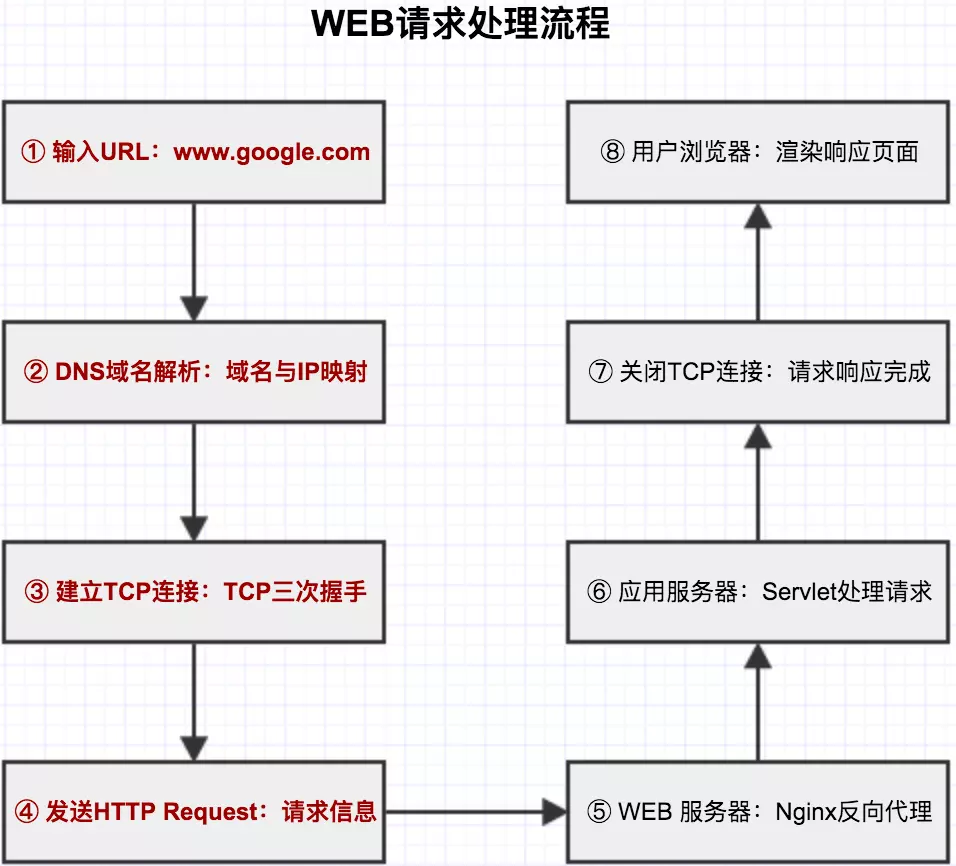

# WEB请求处理系列
- 一套完整的WEB请求处理流程。
- 从浏览器、Nginx、Servlet容器，最终到应用程序WEB请求的一个处理流程。
# WEB请求处理五大部分
1. 《WEB请求处理一：浏览器请求发起处理》：分析用户在浏览器中输入URL地址，浏览器如何找到服务器地址的过程，并发起请求；
2. 《WEB请求处理二：Nginx请求反向代理》：分析请求在达反向代理服务器内部处理过程；
3. 《WEB请求处理三：Servlet容器请求处理》：分析请求在Servlet容器内部处理过程，并找到目标应用程序；
4. 《WEB请求处理四：WEB MVC框架请求处理》：分析请求在应用程序内部，开源MVC框架的处理过程；
5. 《WEB请求处理五：浏览器请求响应处理》：分析请求在服务器端处理完成后，浏览器渲染响应页面过程；
# 图示

