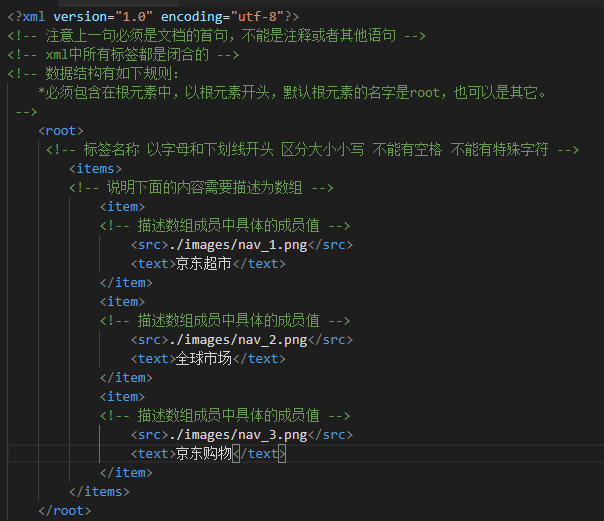
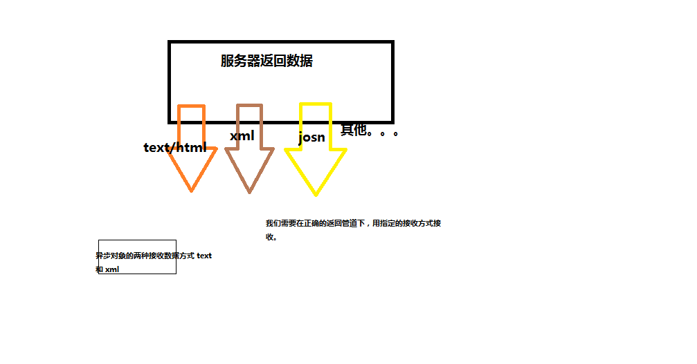

#HTTP服务&AJAX编程

​                  

# 第1章 AJAX编程 


## 1.1  Ajax

即 Asynchronous Javascript And XML，AJAX 不是一门的新的语言，而是对现有持术的综合利用。

       	1. 基于web标签的xhtml+css
     	2. 可以使用dom进行动态的显示和交互
     	3. 使用XML(一种存储数据的方式与json作用相同)和XSLT(是一种用于将XML[文档](https://baike.baidu.com/item/%E6%96%87%E6%A1%A3)转换任意文本的描述语言)进行数据的交换和操作
     	4. 使用XMLHttpRequest进行异步的数据查询和检索等操作。。。

**本质**:是在HTTP协议的基础上以异步的方式通过XMLHttpRequest(XHR)对象与服务器进行通信。

作用：可以在页面不刷新的情况下，请求服务器，局部更新页面的数据；

## 1.2  异步（Asynchronous [eɪˈsɪŋkrənəs])

指某段程序执行时不会阻塞其它程序执行，其表现形式为程序的执行顺序不依赖程序本身的书写顺序，相反则为同步。 

其优势在于不阻塞程序的执行，从而提升整体执行效率。

同步：同一时刻只能做一件事，上一步完成才能开始下一步

异步：同时做多件事，效率更高

XMLHttpRequest可以以异步方式的处理程序。

****

我们需要检测并判断响应头的MIME类型后确定使用request.responseText或者request.responseXML

## 1.3 XMLHttpRequest对象及其属性和方法

#### XHR对象简述

- 用于与服务器通信(交换数据) ，由此我们便可实现对网页的部分更新，而不是刷新整个页面。
- 通过XHR我们可以实现后端返回接口，前端拿到接口进行渲染。不再使用后端渲染页面的形式。


- XHR对象是一个js中内置的异步请求对象，主要就是代替主进程发生请求，并负责把响应带回。
- XHR的特点：异步发送请求，不影响主进程的执行。
- XHR的原理：是基于http请求协议实现通信的，所以我们需要设置符合http请求报文和响应报文的格式数据。

#### XHR对象方法

- 我们通常用规定的变量名 xhr 来接收异步对象。

  ~~~javascript
  var xhr = new XMLHttpRequest();
  ~~~


- xhr.open(请求方式,请求url,async）发起请求，**设置请求行**
  - get请求，如果有参数，需要在url中拼接参数
  - post请求，如果有参数，需要在请求体中传递参数
  - async，一个可选的布尔参数，默认为`true`，表示要不要异步执行操作，如果为false表示同步操作。
- xhr.setRequestHeader('key','value') ,**设置请求头**
  - get请求不需要设置请求头
  - post请求需要设置 Content-Type:application/x-www-form-urlencoded，就是设置请求体中参数编码格式。将参数编码为键值对的格式，标准格式。
- xhr.send('key1=value1&key2=value2’) ,**设置请求体**  ，函数参数是格式化字符串。
  - get方式使用xhr.send(null),不设置请求体。
  - post需要设置请求体
- xhr.getAllResponseHeaders() 获取响应头中所有信息
- xhr.getResponseHeader('key') 获取响应头中指定的信息

#### XHR对象的属性  

- xhr.responseText、xhr.responseXML **接收响应体里面的数据**

  - responseText:以普通字符串接收响应体里的数据
  - responseXML：以符合xml格式的字符串接收响应体里的数据
  - 我们如何决定采用哪种形式接收响应体中的数据
    - 通过判断响应头里面Content-Tpye,来决定。

- xhr.readystate 属性有五个状态：**异步对象的响应状态**

  - xhr.readyState = 0时，（未初始化）还没有调用send()方法
  - xhr.readyState = 1时，（载入中）已调用send()方法，正在发送请求
  - xhr.readyState = 2时，（载入完成）send()方法执行完成，已经接收到服务器全部响应内容（此时是一对二进制码还不可以在客户端直接使用）
  - xhr.readyState = 3时，（交互）正在解析响应内容
  - xhr.readyState = 4时，（完成）响应内容解析完成，可以在客户端调用了。

- xhr.status**获取服务器的响应状态**，如200表示响应成功。

  - xhr.status表示响应码，如200

    ~~~
    100——客户必须继续发出请求
    101——客户要求服务器根据请求转换HTTP协议版本
    200——响应成功
    201——提示知道新文件的URL
    202——接受和处理、但处理未完成
    203——返回信息不确定或不完整
    204——请求收到，但返回信息为空
    205——服务器完成了请求，用户代理必须复位当前已经浏览过的文件
    206——服务器已经完成了部分用户的GET请求
    300——请求的资源可在多处得到
    301——删除请求数据
    302——在其他地址发现了请求数据
    303——建议客户访问其他URL或访问方式
    304——客户端已经执行了GET，但文件未变化
    305——请求的资源必须从服务器指定的地址得到
    306——前一版本HTTP中使用的代码，现行版本中不再使用
    307——申明请求的资源临时性删除
    400——错误请求，如语法错误
    401——请求授权失败
    402——保留有效ChargeTo头响应
    403——请求不允许
    404——没有发现文件、查询或URl
    405——用户在Request-Line字段定义的方法不允许
    406——根据用户发送的Accept拖，请求资源不可访问
    407——类似401，用户必须首先在代理服务器上得到授权
    408——客户端没有在用户指定的时间内完成请求
    409——对当前资源状态，请求不能完成
    410——服务器上不再有此资源且无进一步的参考地址
    411——服务器拒绝用户定义的Content-Length属性请求
    412——一个或多个请求头字段在当前请求中错误
    413——请求的资源大于服务器允许的大小
    414——请求的资源URL长于服务器允许的长度
    415——请求资源不支持请求项目格式
    416——请求中包含Range请求头字段，在当前请求资源范围内没有range指示值，请求也不包含If-Range请求头字段
    417——服务器不满足请求Expect头字段指定的期望值，如果是代理服务器，可能是下一级服务器不能满足请求
    500——服务器产生内部错误
    501——服务器不支持请求的函数
    502——服务器暂时不可用，有时是为了防止发生系统过载
    503——服务器过载或暂停维修
    504——关口过载，服务器使用另一个关口或服务来响应用户，等待时间设定值较长
    505——服务器不支持或拒绝支请求头中指定的HTTP版本
    ~~~

- xhr.statusText 表示响应行中服务器的响应状态 响应成功为OK

#### XHR对象的事件

- xhr.onreadystatechange:   当异步对象的监听状态发生变化时触发。

#### XHR对象（异步请求对象）完整的业务逻辑

~~~javascript
//首先我们需要创建一个异步对象
var xhr = new XMLHttpRequest();
//创建请求报文
//1.创建请求行  请求头包括 请求方式 和 请求url
//如果是get请求需要在url中拼接参数
xhr.open();
//2.创建请求头 请求体包括对请求体中参数的编码方式 
//get请求不需要设置  post请求一般设置为Content-Type:application/x-www-form-urlencoded
xhr.setRequestHeader("Content-Type","application/x-www-form-urlencoded");
//3.设置请求体  请求中携带的数据
//get请求没有请求体，一般设置为null post请求需要拼接参数以键=值的形式
xhr.send(null);  xhr.send("attr1=value1&attr2=value2..");
//我们需要获取响应报文中响应体的数据
//我们需要在什么时候，在什么状态下才能正确的获取到响应数据
//我们需要在异步对象的响应状态发生变化时（通过事件onreadystatechange）并且在服务器响应状态成功(status)（200）和异步对象响应状态(readyState)为4（表示已经把响应数据成功解析，可以使用了）
//通过判断响应头中的Content-Typpe 来决定以哪种形式接收响应体中的数据
//如何获取，通过xhr.responseText 和 xhr.responseXML ,获取我们想要的类型。
xhr.onreadystatechange = function () {
    if (xhr.status == 200 && xhr.readyState == 4) {
         console.log(xhr.responseText);
       }
}
~~~

**注GET和POST请求方式的差异（面试题）**

1、GET没有请求主体，使用xhr.send(null)

2、GET可以通过在请求URL上添加请求参数

3、POST可以通过xhr.send('name=itcast&age=10')

4、POST需要设置

Content-type:application/x-www-form-urlencoded

5、GET大小限制约4K，POST则没有限制

问题？如何获取复杂数据呢？

## 1.4  XML extensible markup language

XML是一种标记语言，很类似HTML，其宗旨是用来传输数据，具有自我描述性（固定的格式的数据）。



### 1.4.1   语法规则

1、必须有一个根元素 

2、标签名称不可有空格、不可以数字或.开头、大小写敏感

3、不可交叉嵌套

4、属性双引号（浏览器自动修正成双引号了）

5、特殊符号要使用实体如空格：&nbsp

6、注释和HTML一样

虽然可以描述和传输复杂数据，但是其解析过于复杂并且体积较大，所以实现开发已经很少使用了。

- 以xhr.responseXml 接收是一个#document数据类型，我们可以用操作DOM的方式来操作它。

## 1.5  JSON

即 JavaScript Object Notation，另一种轻量级的文本数据交换格式，独立于语言。

### 1.5.1   语法规则

1、数据在名称/值对中

2、数据由逗号分隔(最后一个健/值对不能带逗号)

3、花括号保存对象方括号保存数组

4、使用双引号 

### [1.5.2   JSON]()解析

JSON数据在不同语言进行传输时，类型为字符串，不同的语言各自也都对应有解析方法，需要解析完成后才能读取

1、Javascript 解析方法

JSON对象   JSON.parse()、 JSON.stringify()；

2、PHP解析方法

json_encode() 可以将php数组或者对象转换为json格式的字符串。

json_decode() 可以将json格式的字符串转换为数组或者对象，

总结：JSON体积小、解析方便且高效，在实际开发成为首选。

### 1.5.3 服务器返回数据与异步对象接收方式

- XML需要设置服务器返回数据管道为xml，响应头为header("Content-Type:application/xml; charset=utf-8")
- JSON需要设置服务器返回数据管道为json，响应头为header("Content-Type:application/josn; charset=utf-8")



## 1.6  封装AJAX工具函数

为了提升我们的开发效率，我们自已将XMLHttpRequest封装成一个函数。

## 1.7  jQuery中的Ajax

jQuery为我们提供了更强大的Ajax封装

$.ajax({}) 可配置方式发起Ajax请求

$.get() 以GET方式发起Ajax请求

$.post() 以POST方式发起Ajax请求

$('form').serialize()序列化表单（即格式化key=val&key=val）

url 接口地址

type 请求方式

timeout 请求超时

dataType 服务器返回格式

data 发送请求数据

beforeSend:function () {} 请求发起前调用

success 成功响应后调用

error 错误响应时调用

complete 响应完成时调用（包括成功和失败）

**jQuery Ajax介绍**

**http://www.w3school.com.cn/jquery/jquery_ref_ajax.asp**

## 1.8  案例练习

1、Loading状态

2、禁止重复提交

3、表单处理

4、数据验证

 

 

## 1.9  接口化开发

请求地址即所谓的接口，通常我们所说的接口化开发，其实是指一个接口对应一个功能，并且严格约束了请求参数和响应结果的格式，这样前后端在开发过程中，可以减少不必要的讨论，从而并行开发，可以极大的提升开发效率，另外一个好处，当网站进行改版后，服务端接口只需要进行微调。

# 第2章 模板引擎

- 是一种用户界面与业务数据相分离的方式，它用于生成特定的结构块。
- 作用：渲染数据时  代替 拼接字符串的操作 。

Js插件 template_native.js

## 2.1  流行模板引擎

**BaiduTemplate**：http://tangram.baidu.com/BaiduTemplate/ 百度开发的

**ArtTemplate**：http://aui.github.io/art-template/zh-cn/  腾讯开发的

https://aui.github.io/art-template/
**velocity.js**：https://github.com/shepherdwind/velocity.js/

**Handlebars**：http://handlebarsjs.com/
http://blog.jobbole.com/56689/

## 2.2  artTemplate

- arTemplate有两种语法

  - 原生语法

    - 引入template-native.js

    - 逻辑表达式<% 与 %>符号包裹起来的语句则为模板的逻辑表达式（js里面的变量、判断、循环）

    - 输出表达式（编码可以防止数据中含有html字符串，避免引起XSS攻击）

      - 对内容编码输出 <%=content%>
      - 不编码输出 <%=#content%>

    - 示例

      ~~~javascript
      //判断语句
      <% if 条件 %>
        <p>内容</p>
      <% else if 条件%>
        <p>内容</p>
      //循环语句
      <h1><%=value%></h1>
        <ul>
          <%for(i=0;i<arr.length;i++){%>
          <li>数组元素的内容<%=i + 1%>:<%=arr[i]%></li>
            <%}%>
        </ul>
      ~~~

    - 完整应用

      ~~~html
      //首先写我们需要的代码模板。
      <script type="text/template" id="navTemp">
      //与php混编十分相似，但是如果是输出的话需要特定的输出表达式
          <% for(var i=0;i<items.length;i++){ %>
              <li>
                  <a href="#">
                      " alt="">
                      <p><%=items[i].text%></p>
                  </a>
              </li>
          <% } %>
        </script>
      <script>
          // 单个数据的动态结构生成
          // var obj = {
          //    "src":"./images/nav_1.png" ,
          //    "text":"京东超市"
          // };
           调用模板引擎中的函数，返回值为替换之后的动态结构
          // // var html = template(模板id,数据(对象));
          // var html = template("navTemp",obj);
          // console.log(html);
          // document.querySelector("ul").innerHTML = html;

          // 多个数据的动态结构生成
          var arr = [
              {
              "src":"./images/nav_1.png" ,
              "text":"京东超市"
              },
              {
                  "src":"./images/nav_2.png" ,
                  "text":"全球购物"
              },
              {
                  "src":"./images/nav_3.png" ,
                  "text":"京东市场"
              }
          ];
          // 如果数据是一个对象，就直接传入对象
          // 如果数据是一个数组，就包装为对象再传递
          // 因为在模板中只能使用当前传入的对象的属性，它会根据属性自动的去获取对应的值来使用
          var html = template("navTemp",{"items":arr});
          console.log(html);
          document.querySelector("ul").innerHTML = html;
      </script>
      ~~~

  - 简洁语法

    - 引入template.js

    - 注意不要{{}}左右两边不要加空格

    - 逻辑表达式：{{  }}符号包裹起来的语句则为模板的逻辑表达式（js里面的变量、判断、循环）

    - 输出表达式（编码可以防止数据中含有html字符串，避免引起XSS攻击）
      - 对内容编码输出{{content}}
      - 不编码输出 {{#content}}

    - 示例

      ~~~javascript
      //判断语句
      {{if 条件 }  
        <p>内容</p>
      {{else if 条件}}
        <p>内容</p>
      {{/if}}

      //循环语句 循环采用each，注意 值在前面  键（索引）在后面
      {{each list as value index}}
        <li> {{index}} = {{value.user}}   </li>
      {{/each}}
        //也可以简写为
       {{each list}}
         <li>{{$index}} - {{$value.user}}</li>
      {{/each}}
      ~~~

    - 完整应用

      ~~~html
      <script type="text/template" id="navtemp">
      //逻辑表达式需要用{{}},输出表达式也需要用{{}}
      {{each items as value index}}
      	<li>
        		<a>
        			
        			<P> {{value.text}} </p>
        		</a>
        	</li>
        	{{/each}}
      </script>>
      <script>
      	// 多个数据的动态结构生成
          var arr = [
              {
              "src":"./images/nav_1.png" ,
              "text":"京东超市"
              },
              {
                  "src":"./images/nav_2.png" ,
                  "text":"全球购物"
              },
              {
                  "src":"./images/nav_3.png" ,
                  "text":"京东市场"
              }
          ];
        //我们需要根据数据，来写我们想要的模板
        //如果数据是一个数组的话，我们需要包装成一个对象再传入。
        //调用模板引擎中的函数，返回值为替换之后的动态结构。
       // template("模板id",数据(对象))
        
       var html = template("navtemp", {"items":arr});
       
      </script>
      ~~~

- 转义与不转义的区别

  - 默认转义:会把这样的数据：<span style="color: #f00">hello word</span>  当作字符串原样输出。
  - 不转义：会把这样的数据：<span style="color: #f00">，当作标签来解析。

# 第3章 同源&跨域

## 3.1  同源

同源策略是浏览器的一种安全策略，所谓同源是指，域名，协议，端口完全相同。

[www.jd.com--->www.taobao.com](http://www.jd.com---%3ewww.taobao.com)

[www.taobaol.com](http://www.taobaol.com)

M.taobao.com  www.zfb.com

 

## 3.2  跨域

不同源则跨域：域名，协议，端口只要有一个不一样，就是跨域。

1-不允许进行DOM操作

2-不能进行ajax请求

例如http://www.example.com/

| http://api.example.com/detail.html       | 不同源  | 域名不同    |
| ---------------------------------------- | ---- | ------- |
| https//www.example.com/detail.html       | 不同源  | 协议不同    |
| http://www.example.com:8080/detail.html  | 不同源  | 端口不同    |
| http://api.example.com:8080/detail.html  | 不同源  | 域名、端口不同 |
| https://api.example.com/detail.html      | 不同源  | 协议、域名不同 |
| https://www.example.com:8080/detail.html | 不同源  | 端口、协议不同 |
| http://www.example.com/detail/index.html | 同源   | 只是目录不同  |

## 3.3  跨域方案

1、顶级域名相同的可以通过domain.name来解决，即同时设置 domain.name = 顶级域名（如example.com）

2、window.name+ iframe 需要目标服务器响应window.name

3、location.hash+ iframe 同样需要目标服务器作处理

4、html5的 `postMessage+ifrme` 这个也是需要目标服务器或者说是目标页面写一个postMessage，主要侧重于前端通讯。

**参考资料**

**http://rickgray.me/2015/09/03/solutions-to-cross-domain-in-browser.html**

以上几种解决方案多数只能在某一特定情形下使用，兼容性及通用性都不够好，更通用的是JSONP解决方案。**

## 3.4 服务器端跨域-- CORS(cross-origin-resource-sharing)跨域

header("Access-Control-Allow-Origin")

~~~php
header("Access-Control-Allow-Origin:*");
//值代表：允许哪些域名来对当前域进行跨域访问 ， * 代表允许所有域名来对当前域进行跨域访问。
//我们也可以指定某个具体的域名
hedaer("Access-Control-Allow-Origin:http//www.exam.com");
~~~

## 3.5  JSONP

JSON with Padding

**1**、原理剖析

其本质是利用了<script src=""></script>标签具有可跨域的特性，由服务端返回一个预先定义好的Javascript函数的调用，并且将服务器数据以该函数参数的形式传递过来，此方法需要前后端配合完成。

注意：只能以GET方式请求	

~~~
有一些属性可以天然的实现跨域请求：
href
src
我们简述一下原理，首先通过script标签的src属性发生请求，服务器端给我们返回字符串，如果是符合js语法的字符串那么就会执行js代码。
比如：echo "abc",那么返回结果在js中就是一个未定义的变量abc.

首先我们需要定义一个函数声明，function test() {}
所以我们在发送请求时，动态的创建script标签在src属性中的url上拼接一个参数，参数值是一个函数名callback=test
然后服务器端接收这个参数$callback，把返回数据转换成字符串$data，
然后把拼接字符串为$callback."($data)"整体返回,此时返回的数据在js语法中就是函数调用。


注意：我们要把包含函数声明的script标签写在前面，发送请求script标签写在后面，因为需要保证函数先声明再调用。
~~~


## 3.6  jQuery中的JSONP

jQuery 的$.ajax() 方法当中集成了JSONP的实现，可以非常方便的实现跨域数据的访问。

dataType:'jsonp' 设置dataType值为jsonp即开启跨域访问.

~~~
dataType:'jsonp'  
当我们设置dataType:'jsonp'时，JQ会动态创建script标签在src属性的url中拼接参数，参数形式是一个callback="字符串"。
我们需要把后台返回的数据$data，以函数参数的形式进行拼接。
我们需要后端进行配合，我们接收这个字符串$callback，然后再进行拼接，拼接成$calllback."($data)",然后再整体返回。
此时就是一个函数调用。

$.ajax({
注意当我们设置dataType: "jsonp"时，我们可以给一个jsonpCallback:function(){}当返回数据时调用指定的函数，如果不设置默认使用success函数。
})
~~~

**案例练习**

** **

天气接口：

<http://lbsyun.baidu.com/index.php?title=car/api/weather>

天气预报的密钥：zVo5SStav7IUiVON0kuCogecm87lonOj

百度API：

<http://apistore.baidu.com/>

密钥：

21f068f20fd5b7ca99c8908c1ae9f2bb

 

图灵机器人：http://www.tuling123.com/register/index.jhtml

# 第4章 XMLHttpRequest2.0

技术总是在实践中不断更新的，XMLHttpRequest也不例外。

## 4.1  设置超时

a)    设置超时时长 xhr.timeout  单位是毫秒

b)    监听超时事件 xhr.ontimeout = function (e) {// code}，e是请求对象参数

当请求超时，此事件就会被触发。

## 4.2  FormData

- **JS提供提供了一个新的内建对象，可用于管理表单数据**	

a)    提供了一个新的内建对象，可用于管理表单数据

b)    首先要获取一个表单元素form

c)    然后在实例化时 var formdata = new FormData(form)，将表单元素form传进去

d)    会返回一个对象，此对象可以直接做为xhr.send(formData)的参数

e)    此时我们的数据就是以二进制形式传递了，没有拼接字符串，所以必须是post请求。

f)     注意我们这里只能以post形式传递，浏览器会自动为我们设置一个合适的请求头。如果人为的设置请求头，那么数据无法正确的显示。

h)   可以自由的追加参数。 这个对象有一个append函数，formdata.append("属性","值")

- 类型为form的DOM元素有一个reset(), 可以把表单的数据重置（清除）。

## 4.3  文件上传

a)    我们上传文件是以二进制形式传递的

b)    我们可以通过表单<input type=”file”>获取到一个文件对象

c)    然后file.files[0]可以获取文件信息

d)    然后再利用var formData = new FormData() 实例化

e)    然后再利用formData.append(‘upload’, file.files[0])将文件转成二进制

f)     最后将 formData 做为xhr.send(formData)的参数

h)  上传文件时要注意文件大小是否需要修改配置文件，而且在文件写入时文件名不要为中文。

## 4.4  上传进度

a)    利用XMLHttpRequest我们可以实现文件的上传

b)    并且我们可以通过xhr.upload.onprogress = function (e) {// code}，监听上传的进度，e是事件对象参数。

c)    这时我们上传的进度信息会保存在事件对象ev里

d)    e.loaded 表示已上传的数据大小，e.total表示文件数据整体的大小

e)    var percent = e.loaded / e.total

g)  监听事件必须写在异步对象的send方法之前。

~~~javascript
    <script>
      //利用FormDate对象，收集表单数据，实现文件的上传，并且通过异步对象的upload.onprogress 监听事件，来实时显示
      //上传进度
      document.querySelector("#sub").onclick = function () {
        //创建异步对象
        var xhr = new XMLHttpRequest();
         //发生请求
        xhr.open("post","./03-uploadFile.php");
        //使用表单数据对象 FormDate 需要知道请求方式为post,同时我们不需要设置请求头，让浏览器给我们自动生成。
        //如果强行指定，会造成不可知错误
        // xhr.setRequestHeader("Content-Type","application/x-www-form-urlencoded");
        //此时php的$_FLIES[] 中没有接收到文件数据
       //收集表单数据 
       var form = document.querySelector("#form1");
       var formdata = new FormData(form);
       //文件上传进度监听事件必须写在send的前面
       //xhr.upload,onprogress = func () {};
       //此时我们上次一个较大的文件如视频
       xhr.upload.onprogress = function (e) {
        //e是事件对象参数
       ///e里面有两个属性我们需要关注一下
       //e.total 文件的总大小
       //e.loaded 文件已上传的大小
       var percent = Math.floor(e.loaded / e.total  * 100) +"%";
       document.querySelector(".in").style.width = percent;
       document.querySelector("span").innerHTML = percent;
       }
       xhr.send(formdata);
       //设置请求超时
    //    xhr.timeout = 3000;
    //    xhr.ontimeout = function (e) {
    //     console.log(e);
    //    };
        //接收响应数据
        xhr.onreadystatechange = function () {
            if (xhr.status == 200 && xhr.readyState == 4) {
                console.log(xhr.responseText); 
            }
        }
      }
    </script>
~~~
# 富文本
- ## 富文本编辑器

  ​	在对文章的内容进行编辑的时候，如果只是单纯的文字，那么是非常单调的。我们平时在网上看到的文字，很少会只有纯文字的。那么，我们要如何做才能让文字更加丰富呢——富文本。

  ​	什么是富文本？

  ​		所谓富文本，即为有格式的文本。比如文章中有段落区分，有字体大小区分等等，甚至可以在文章中出现插图之类的，会更加丰富文章的形式。而我们要实现这样的格式，就要依赖于富文本插件。

  ​	在这个项目中用到的富文本插件，叫[CKEDITOR](https://ckeditor.com/ckeditor-4)，是一款非常不错的富文本插件。当然市面上也有其他的富文本插件，用法都是很类似的。

  该插件的用法很简单，可以看下面的示例，也可以自己到官方网站上学习。

  ```html
  <!DOCTYPE html>
  <html>
      <head>
          <meta charset="utf-8">
          <title>A Simple Page with CKEditor</title>
          <!--引入ckeditor插件-->
          <script src="../ckeditor.js"/>
      </meta></head>
      <body>
          <form>
              <textarea name="editor1" id="editor1" rows="10" cols="80">
                  这个文本域将会被替换成为富文本编辑器
              </textarea>
              <script>
                  // 调用API将文本域实例化为富文本编辑器
                  // 用法： CKEDITOR.replace( 文本域的id );
                  CKEDITOR.replace( 'editor1' );
              </script>
          </form>
      </body>
  </html>
  ```

  ​	参照插件的用法，我们在页面中已经有了一个用于编辑文章内容的文本域`<textarea id="content" ... ></textarea>`，所以只要我们把下载好的插件引入页面，然后调用实例化的方法实例化编辑器即可。

  ```javascript
  CKEDITOR.replace("content");
  ```

  ​	然后我们希望在点击保存按钮的时候把数据发送到服务端。但是我们发现直接调用jquery的序列化表单的方法`$().serialize()`方法把数据获取出来的时候，发现内容是空的。因为我们只是把富文本编辑器里面的内容编辑了，没有同步到文本域中，需要在点击保存按钮的时候，把文章内容先同步到文本域。

  ​	CKEDITOR也准备好了对应的API供我们操作。只要直接调用编辑器对象的`updateElement`方法就可以把数据同步回到文本域，我们才能获取到数据。具体的做法为：

  ```javascript
  //CKEDITOR.instances 是当前页面中所有编辑器对象的实例集合，可以通过对应的id直接得到想要的编辑器对象。
  //  CKEDITOR.instances.content 这个content就是我们实例化的时候使用的id，这个对象就是我们想要找的编辑器对象。
  // 调用 updateElement方法可以把内容同步到对应的文本框
  CKEDITOR.instances.content.updateElement();
  ```

  所以对应的保存按钮的事件和处理函数为：

  ```javascript
  // 点击保存按钮
  $("#btn-save").on("click",function(){
    // 在收集数据之前，得先把富文本编辑器中的内容更新到文本域当值
    /*
      如果要把编辑器中的内容，更新到对应的文本域里面
      需要调用插件提供的一个方法： 编辑器对象.updateElement()
      获取编辑器对象：  CKEDITOR.instances.初始化的时候所使用的id
  */
    CKEDITOR.instances.content.updateElement();//把编辑器中的内容更新到文本域中
    // 点击保存按钮收集表单的数据，发送回服务端
    var data = $("#data-form").serialize();
    // 发送回服务端进行文章的新增操作
    $.ajax({
      url : "api/_addPost.php",
      data : data,
      type : "POST",
      success : function(res){
        // 处理新增成功的逻辑
      }
    });
  });
  ```

  在这个项目中我们介绍的是一款依赖于jquery的[分页插件](http://esimakin.github.io/twbs-pagination) ，使用方式也是比较简单的。

  首先需要一个很简单的静态结构

  ```html
  <ul id="pagination-demo" class="pagination-sm"></ul>
  ```

  然后引入必要的文件

  ```html
  <link rel="stylesheets" href='css的路径'></link>
  <script src='jquery的路径'></script>
  <script src='插件的路径'></script>
  ```

  然后调用插件的方法即可

  ```javascript
  $('#pagination-demo').twbsPagination({
    totalPages: 35,//最大页码数
    visiblePages: 7,// 显示多少个分页按钮
    onPageClick: function (event, page) {// 分页按钮的点击事件
      // Todo .....
    }
  });
  ```

  插件可以配置的参数：

  

# 使用分页插件完成分页展示

  在页面中已经有有了静态结构了

  ```html
  <ul class="pagination pagination-sm pull-right"></ul>
  ```

  然后我们引入必要的文件

  ```html
  <!-- bootstrap 的css文件 -->
  <link rel="stylesheet" href="../static/assets/vendors/bootstrap/css/bootstrap.css">
  <script src="../static/assets/vendors/jquery/jquery.js"></script>
  <!-- 引入插件 -->
  <script src="../static/assets/vendors/twbs-pagination/jquery.twbsPagination.js"></script>
  ```

  调用方法生成分页按钮

  ```javascript
  $('.pagination').twbsPagination({
    totalPages: pageCount,//最大的页码数
    visiblePages: 7,// 总共显示多少个分页按钮
    onPageClick: function (event, page) { ... }
  });
  ```

  分页按钮在点击的时候还要获取数据，所以在分页按钮的点击事件里面我们可以调用获取数据的函数

  ```javascript
  $('.pagination').twbsPagination({
    totalPages: pageCount,//最大的页码数
    visiblePages: 7,// 总共显示多少个分页按钮
    onPageClick: function (event, page) { // 点击每个分页按钮的时候执行的操作
      // 回调函数有两个参数，第一个是事件对象，第二个是当前的页码数
      currentPage = page;
      //每次点击分页的按钮，也要获取数据
      getCommentsData();
    }
  });
  ```

  而分页按钮的生成需要在第一次获取数据之后生成，也需要从后台计算出一个最大页码数，所以我们第一次获取数据的前端代码修改为：

  ```javascript
  function getCommentsData(){
    // 使用模板引擎的方式完成表格的数据展示
    $.ajax({
      url : "api/_getCommentsData.php",
      type : "POST",
      data : {currentPage : currentPage , pageSize : pageSize},
      success : function(res){
        if(res.code == 1){
          // 更新一下pageCount
          pageCount = res.pageCount;
          //使用模板引擎生成结构
          // 导入模板的数据
          var html = template("template",res.data);
          $("tbody").html(html);
          // 生成分页按钮
          $('.pagination').twbsPagination({
            totalPages: pageCount,//最大的页码数
            visiblePages: 7,// 总共显示多少个分页按钮
            onPageClick: function (event, page) { // 点击每个分页按钮的时候执行的操作
              // 回调函数有两个参数，第一个是事件对象，第二个是当前的页码数
              currentPage = page;
              //每次点击分页的按钮，也要获取数据
              getCommentsData();
            }
          });
        }
      }
    });
  }
  ```

  需要修改后台的代码让其返回一个分页总数

  ```php
  require_once '../../config.php';
  require_once '../../functions.php';
  /*
    获取从前端得到的当前是第几页，每页获取多少条，连接数据库获取数据
  */
  // 获取从前端得到的当前是第几页，以及每一页取多少条
  $currentPage = $_POST['currentPage'];
  $pageSize = $_POST['pageSize'];
  // 计算出从哪里开始获取数据
  $offset = ($currentPage - 1) * $pageSize;
  // 连接数据库
  $connect = connect();
  // sql语句
  $sql = "SELECT c.id,c.author,c.content,c.created,c.`status`,p.title FROM comments c
  LEFT JOIN posts p on p.id = c.post_id
  LIMIT {$offset},{$pageSize}";
  // 执行查询
  $queryResult = query($connect,$sql);
  // 计算最大的页码数
  // 最大页码数 = ceil(评论的数据总数 / 每页获取的条数)
  // 先说评论的数据总数
  $sqlCount = "SELECT count(*) as count FROM comments";
  $countArr = query($connect,$sqlCount);
  // 取出数据总数
  $count = $countArr[0]['count'];
  $pageCount = ceil($count / $pageSize);
  // 返回数据
  $response = ['code'=>0,'msg'=>"操作失败"];
  if($queryResult){
    $response['code'] = 1;
    $response['msg'] = "操作成功";
    $response['data'] = $queryResult;
    $response['pageCount'] = $pageCount;
  }
  // 返回json格式
  header("content-type: application/json;");
  echo json_encode($response);
  ```

  ## 存在的问题

  ​	我们发现使用插件可以快速完成我们想要的功能，但是引入的插件多了，就会在结构中出现很多的引入代码。插件和插件之间可能还有依赖关系。比如分页插件要依赖于jquery，那么就得注意引入的先后问题，并且在页面中引入这么多的文件也会对结构造成混乱。

  ​	解决方案： 模块化工具

  ​		模块化——让每个功能相互独立

  ​	自己手动的进行模块化也是非常复杂的，我们一般也是使用别人帮咱们封装好的模块化工具进行模块化处理。这个项目中使用的是一款 [requirejs](http://www.requirejs.cn) 的工具。 这里呢我们只是简单的了解一下模块化工具怎么使用。

  ### requirejs的使用步骤

  ```
  1 引入requirejs文件
  2 设置data-main属性  
  	该值是一个js文件的路径
  	data-main属性的作用： 可以设置该模块的入口文件(声明不同的模块，实现业务代码)
  3 在入口文件中，实现模块的声明以及功能的代码
  ```

  ​	比如我们现在在`static/assets/js/`目录下新建一个`comments.js` 文件，专门用来处理comments页面的逻辑，这个js文件就是我们需要的入口文件。

  ​	首先在`comments.php` 页面中引入`requirejs` ，然后设置器`data-main` 属性指向我们刚才创建的`comments.js` 文件。

  ```html
  <script src="../static/assets/vendors/require/require.js" data-main="../static/assets/js/comments.js"></script>
  ```

  ​	此时`comments.js` 就是`requirejs` 需要的入口文件，我们需要在入口文件中对模块进行声明和逻辑处理。

  #### 第一步:配置模块

  ​	需要对模块进行配置，配置好每个模块的路径

  ```javascript
  // 1 配置模块
  // require.config({});
  require.config({
  	// 1.1 声明模块
  	// 一共要声明的模块有： jquery,模板引擎,分页插件,bootstrap
  	paths : {// 作用是： 声明每个模块的名称和每个模块对应的路径

  		// 模块的名字 : 模块对应的js的路径 - 注意路径是不带后缀名
  		"jquery" : "/static/assets/vendors/jquery/jquery",
  		"template" : "/static/assets/vendors/art-template/template-web",
  		"pagination" : "/static/assets/vendors/twbs-pagination/jquery.twbsPagination",
  		"bootstrap" : "/static/assets/vendors/bootstrap/js/bootstrap"
  	}
  });
  ```

  **一定要注意的是：我们以前写路径都是带后缀名的，而requirejs的路径要求不要带后缀名**

  然后要声明多个模块之前的依赖关系，比如分页插件是依赖于jquery的，bootstrap也是依赖于jquery的	

  ```javascript
  // 1 配置模块
  require.config({
  	// 1.1 声明模块
  	// 一共要声明的模块有： jquery,模板引擎,分页插件,bootstrap
  	paths : {// 作用是： 声明每个模块的名称和每个模块对应的路径

  		// 模块的名字 : 模块对应的js的路径 - 注意路径是不带后缀名
  		"jquery" : "/static/assets/vendors/jquery/jquery",
  		"template" : "/static/assets/vendors/art-template/template-web",
  		"pagination" : "/static/assets/vendors/twbs-pagination/jquery.twbsPagination",
  		"bootstrap" : "/static/assets/vendors/bootstrap/js/bootstrap"
  	},
  	// 1.2 声明模块和模块之间的依赖关系
  	shim: {
  		// 模块名字
  		"pagination" : {
  			// deps 声明该模块是依赖哪些模块的
  			deps : ["jquery"] // 因为依赖的模块可能有多个，以数组的方式表示
  		},
  		"bootstrap" : {
  			deps : ["jquery"]
  		}
  	}
  });
  ```

  #### 第二步:引入模块

  是需要引入声明好了的模块。

  ```javascript
  // 2 引入模块
  // 使用requirejs提供的一个函数来实现
  // require(模块的数组,实现功能的回调函数);
  // 模块数组中的每个模块的名字是从paths声明的时候那里直接得到的
  // 第二个参数是回调函数，里面的每个形参依次用来接收前面的的多个模块
  require(["jquery","template","pagination","bootstrap"],function($,template,pagination,bootstrap){});
  ```

  #### 第三步:实现逻辑

  是在回调函数中实现我们的逻辑功能。其实就是把我们写在php页面中的js代码放到了回调函数中而已。

  ```javascript
  require(["jquery","template","pagination","bootstrap"],function($,template,pagination,bootstrap){
  	// 3 在回调实现功能 
  	$(function(){
  		// 声明变量表示当前是第几页 以及 每页取多少条数据
        var currentPage = 1;
        var pageSize = 10;
        var pageCount;
        //一开始就加载一次数据
        getCommentsData();
        function getCommentsData(){
          // 使用模板引擎的方式完成表格的数据展示
          $.ajax({
            url : "api/_getCommentsData.php",
            type : "POST",
            data : {currentPage : currentPage , pageSize : pageSize},
            success : function(res){
              if(res.code == 1){
                // 更新一下pageCount
                pageCount = res.pageCount;
                //使用模板引擎生成结构
                // 导入模板的数据
                var html = template("template",res.data);
                $("tbody").html(html);
                // 还要生成分页结构
                $('.pagination').twbsPagination({
                  totalPages: pageCount,//最大的页码数
                  visiblePages: 7,// 总共显示多少个分页按钮
                  onPageClick: function (event, page) { // 点击每个分页按钮的时候执行的操作
                    // 回调函数有两个参数，第一个是事件对象，第二个是当前的页码数
                    currentPage = page;
                    //每次点击分页的按钮，也要获取数据
                    getCommentsData();
                  }
                });
              }
            }
          });
        }
  	});
  });
  ```

  **模块化解决的问题：**

  ```
     	1. 在页面中无需关注引入的顺序，只需要在工具中声明依赖关系，工具会自动根据依赖关系进行顺序加载。
   	2. 在页面中看不到多而杂乱的引入标签，只能看到一个引入`requirejs`的标签，结构清晰简洁
  ```

  ​

  ​

  ​

  ​

  ​

  ​


