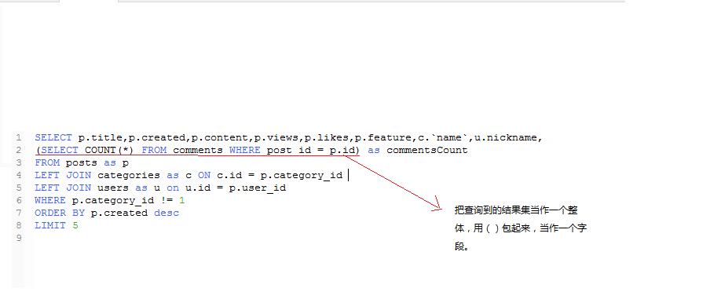

## MySQL

### 准备工作

#### 简介

> 目标：
>
> - 搞明白什么是数据库
> - 如何通过工具操作数据库
> - 如何通过代码操作数据库

数据库就是数据的仓库，用来按照特定的结构去组织和管理我们的数据，有了数据库我们就可以更加方便、便捷的操作（C / R / U / D）我们需要保存的数据。 create Retrieve（读取查询） updata delete

不管是什么数据库，最终都是将数据存到文件（硬盘）中，只是存储的格式不同于文本文件。

一个 Excel 文件就可以看做一个数据库：


一个 Excel 文件中可以包含多个数据表：


### 基础操作

#### 数据库管理工具

数据库管理工具本质上就是一个使用数据库服务器软件（Server）提供的服务的数据库客户端（Client）。

##### 命令行工具(了解)

一般如果只是简单操作数据库，可以使用 MySQL 内置的命令行工具完成：

进入 MySQL 客户端的 REPL 环境过后，可以通过标准的 SQL 语句操作数据库。

常见的操作指令：

```sql
mysql> show databases;  -- 显示全部数据库
mysql> create database <db-name>;  -- 创建一个指定名称的数据库
mysql> use <db-name>;  -- 使用一个数据库，相当于进入指定的数据库
mysql> show tables;  -- 显示当前数据库中有哪些表
mysql> create table <table-name> (id int, name varchar(20), age int);  -- 创建一个指定名称的数据表，并添加 3 个列
mysql> desc <table-name>;  -- 查看指定表结构
mysql> source ./path/to/sql-file.sql  -- 执行本地 SQL 文件中的 SQL 语句
mysql> drop table <table-name>;  -- 删除一个指定名称的数据表
mysql> drop database <db-name>;  -- 删除一个指定名称的数据库
mysql> exit|quit;  -- 退出数据库终端
mysql> show varitables like "%max_connectcount%"  -- 查询sql可连接数

CREATE TABLE IF NOT EXISTS `runoob_tbl`(
   `runoob_id` INT UNSIGNED AUTO_INCREMENT,
   `runoob_title` VARCHAR(100) NOT NULL,
   `runoob_author` VARCHAR(40) NOT NULL,
   `submission_date` DATE,
   PRIMARY KEY ( `runoob_id` )
)ENGINE=InnoDB DEFAULT CHARSET=utf8;
```

##### 可视化工具

如果需要复杂的操作，推荐 Navicat Premium

> 下载地址：http://www.navicat.com.cn/download/navicat-premium
>
> 这是一个付费软件，可以免费试用 14 天
>
> 创建主键：非空和唯一，主键是具有强烈标识的属性，我们需要通过这些主键来查询获取数据。
>
> 创建唯一键：唯一。

#### 基本概念（待补充）

- 数据库
- 表
- 字段 —— 指的就是列
- 字段类型 —— 指的就是列能够存储的数据种类
  - int
  - char(<length>) 指定字符长度，如果输入字符大于指定长度自动截断，如果小于指定长度不会自动回收。
  - varchar(<length>)指定字符长度，如果输入字符大于指定长度自动截断，如果小于指定长度系统会自动回收剩余长度。
  - date
  - decimal
  - enum(value1,value2)枚举:只能输入指定的value1或value2
- 数据库查询：指的是操作数据库的过程（查、增、删、改）
- 设置主键：主键特性唯一和非空
- 设置唯一：特性唯一。
- 数据库查询语言：SQL

#### 基本查询语句

- sql语句不区分大小写


- 查询返回的是结果集


- 增加、删除和修改是返回受影响的行数

##### 查询

```sql
-- 查询语句的语法：select *|字段列表 from 表列表 where 条件   查询可以返回一个结果集(表)
-- *代表当前表的所有字段
-- 1.查询mytalbe中的所有数据
select * from mytable
-- 2.查询mytable中的id和姓名
select id,name from mytable;
-- 查询字段的时候带一个别名
select id,name as '姓名' from mytable;
-- 3.带条件的查询
select * from mytable where id =3
select * from mytable where age < 20
-- 4.创建多条件查询 not>! and>&& or>||
select * from mytable where age < 20 and gender = 0

```

##### 增加

```sql
-- 增加语句的语法：insert [into] 表名[(字段1，字段2，...)] values(值1，值2...)
-- Column count doesn't match value count at row 1:如果表名后没有指定字段那么必须设置对应的数量的值
insert into mytable values(5,'lili',30,0)
-- 如果有标识列，那么标识列一般可以给null值，如果给null,系统会自动生成
insert into mytable values(null,'lili',30,0)
-- 指定需要添加数据的字段
insert into mytable(name,age,gender) values('lili123',30,0)
-- 对于可以为null的字段可以不赋值
insert into mytable(name) values("ok")
-- 非空字段需要赋值，否则系统也不会自动为其生成默认值--建议，非空字段一定要赋值
insert into mytable(age,gender) values(40,1)
```

##### 修改

```sql
-- 修改语句的语法：update 表名 set 字段1 = 值1，字段2=值2...where 条件
update mytable set age = age + 1
update mytable set age = age +10 where id =5 or id = 4
update mytable set age = age +1,gender = 1 where id = 5
```

##### 删除

```sql
-- 删除语句的语法 delete [from] 表名 where 条件
delete from mytable where id = 8
delete from mytable where id in(4,5)
```

#### 常见查询函数

- 总条数 —— count 分页功能，查询总页数

- ​

- “ = ” 在update中相当于赋值操作，在where中就是 相等运算

  ~~~sql
  -- 常见的数学函数--统计
  -- count():可以查询满足条件的记录数 无法对null值进行计算，会忽略null值
  select count(*) from mytable
  select count(id) from mytable
  select count(age) from mytable
  ~~~

- 最大值、最小值 —— max/min

  ~~~sql
  -- max：获取最大值  min:获取最小值
  select max(age) from mytable
  select min(age) from mytable
  select max(name) from mytable //字母排序按照字符的ascii码。
  select min(name) from mytable
  ~~~

- 平均值 —— avg

  ~~~sql
  -- avg:获取平均值，它的参数一般来说是数值
  select avg(age) from mytable
  select avg(name) from mytable
  ~~~

- round 四舍五入


~~~sql
select round(avg(name), 2)from mytable
~~~


- -- order by :排序

- --order by rand() 随机排序

  ~~~sql
  -- select * | 字段列表 from 表列表 where条件 order by 排序字段列表 asc（升序） | desc(降序)

  select * from mytable order by id desc
  select * from mytable ORDER BY name
  select * from mytable ORDER BY gender asc,age asc  -- 先按照gender排序在按照age排序。
  ~~~

- -- limit :获取指定范围的数据

  ~~~sql
  -- limit :获取指定范围的数据
  -- limit后只有一个参数：相当于获取指定的前n条记录
  select * from mytable limit 5
  -- 获取最后n条的排序，先根据id降序排序在获取前n条
  select * from mytable order by id desc limit 3
  select * from mytable limit 3 order by id desc

  -- limit n(偏移量，从0开始),m(获取的记录数,包含开始位置)
  select * from mytable limit 2,4
  -- 两者写法是等价的
  select * from mytable limit 4 offset 2

  int pageSize = 10;  --每一页的信息数量
  int pageCount = 1;  --页码
  select * from mytable limit pageSize offset (pageCount - 1) * pageSize
  select * from mytable limit pageSize offset (pageCount - 1) * pageSize
  select * from mytable limit pageSize offset (pageCount - 1) * pageSize
  ~~~

- 多表查询

- 多表查询时，可以使用表名.字符段的形式，student.cid 

  ~~~sql
  select * from student

  -- 使用from where 的方式
  select * from student,class where student.cid = class.classid
  select studentId,studentName,age,gender,className from student,class where student.cid = class.classid
  -- 另一种写法：交集
  -- INNER JOIN 相当于 逗号 相当于查询多个表，也可以写 JOIN
  -- on  相等于where，是基于什么建立关联。
  select * from student INNER JOIN class on student.cid = class.classid

  -- left join:它可以获取左表中的所有数据，如果建立关联的字段在右表中没有存在，那么右表中的相应字段的数据默认为null
  -- 写在 left JOIN 左边的就是左表，右边的就是右表
  select * from student left JOIN class on student.cid = class.classid
  -- right koin：它可以获取右表中的所有数据，如果建立关联的字段在左表中没有存在，那么左表中的相应字段的数据默认为null
  select * from student right JOIN class on student.cid = class.classid
  ~~~

  ​



