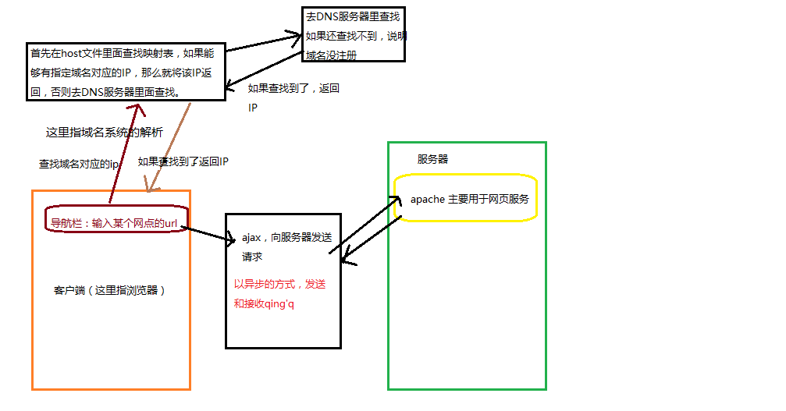

### 客户端与服务器

- 两者的主要差别通俗来说在于安装的软件不同。
- 服务器（提供服务）指的就是一台**安装特定的软件的计算机**，用于专门用于提供特定的服务。
  - 按照服务类型的不同，又划分为：Web 服务器、数据库服务器、文件服务器等等。
- 客户端（使用服务）指的是在一次服务过程中使用这个服务的设备（网络端点）。
  - 目前咱们最常见的客户端就是浏览器
- web服务器常用软件
  - Nginx
  - Apache  -  php
  - IIS  -  C#    .net
  - Tomcat  -   java

### CS架构和BS架构（应用软件架构）

应用软件架构一般分为两类：

- B/S 架构：Browser（浏览器） ←→ Server（服务器），这种软件都是通过浏览器访问一个网站使用，服务器提供数据存储等服务。

- C/S 架构：Client（客户端） ←→ Server（服务器），这种软件通过安装一个软件到电脑，然后使用，服务器提供数据存储等服务。

- 各自的优缺点

  - B/S的优点与缺点：

  ​      优点：部署方便(不用安装)，可维护性强。

  ​      缺点：用户体验不好，不能针对每一个用户的不同特点进行设置。

  - C/S的优点与缺点：

    ​优点：用户体验好

    缺点：部署不方便(需要安装)，可维护性弱。

### 网络基础概念

#### URL

- URL（Uniform Resource Locator），统一资源定位符，通俗点来说就是表示网络当中某一个网页的完整访问地址。

##### URL的语法格式

- url的语法：scheme://host:port/path?query#fragment
  - scheme: 通信协议，常见的有http、https、ftp（文件传输协议）、maito(邮箱协议)。
  - host: 主机，可以是 服务器(计算机)域名系统、 (DNS) 主机名或 IP 地址。
  - port：端口号，http默认是80.
  - path: 路径，由零或多个'/'符号隔开的字符串，一般用来表示主机上的一个目录或文件地址。
  - query:查询，可选，用于给动态网页传递参数，可有多个参数，用'&'符号隔开，每个参数的名和值用'='符号隔开。例如：name=zs
  - fragment:信息片断，字符串，锚点。

#### ip地址（Internet Protocol Address）

- IP地址又成为网络协议地址，是设备在设备在某一个网络（局域网，互联网）中的地址，不同网络上设备的IP地址会发生变化。
- IP地址是唯一的，具有不可重复性。直接指向某台设备。
- IP地址的常见格式：[0-255].[0-255].[0-255].[0-255]，本质上是8位的二进制数据11111111,不过为了方便表述以10进制的形式表现。
- localhost:是本机的回环地址对应IP地址127.0.0.1，正常情况向下我们在浏览器的导航栏中通过127.0.0.1或者localhost是无法访问的，只有当本机部署服务器环境后才能访问。

#### 单个网络情况和多个网络情况

- 单个网络：

  - 在单个局域网下，结构非常简单，就是我们所连接的网络设备（网关）给我们分配了一个地址，在**这个范围之内**我们都可以通过这个地址找到我们的这个设备。

  - 比如：我们通过路由器连接网络，那么路由器就会给我们设备自动分配IP地址。

    > 如果设备没有连接任何网络情况下，我们会有一个本地回环地址 127.0.0.1

- 多个网络：

  - 但是当一个设备同时处于多个网络下（比如同时连接了有线网卡和无线网卡），就会变得稍微复杂一点：
  - 我们的设备会有两个IP地址，分别对应着在无线连接和有线连接的情况。这两个IP地址，因为作用的环境不一样，所以互不影响。

#### 域名系统

##### 域名系统的实质

- 域名其实就是映射到指定的网点IP地址，由于网点IP地址不容易被人们熟记，为了方便人们可以访问某个网点，就有了域名系统（IP的别名）。
- 域名数需要花钱注册的。

##### 特殊域名

- localhost：含义是本机的域名，对应IP地址 127.0.0.1

##### 顶级域名

.com: 商业机构 
.cn: 中国国家、地区域名 .hk,
.gov: 政府网站。
.org: 机构。
.edu: 教育网站。
.net: 网络服务商。   php.net
.mil: 军事。

### DNS域名解析工具

- 通过宽带运营商提供的服务器解析一个域名背后对应的 IP，这个过程叫做 **DNS 寻址**，帮你完成 DNS 寻址过程的服务器叫做 **DNS 服务器**。
- DNS里面其实是域名和IP地址的映射表。

### 硬解析-host文件

- 硬解析就是指host文件。
- 操作系统在发起对 DNS 服务器的查询请求之前，会优先检查本机的 hosts 文件。如果这个文件中包含了对当前需要解析的域名的配置，则不再发起对 DNS 服务器的请求，直接使用 hosts 文件中的配置。
- 如果本机没有配置服务器环境，那么我们在host 文件中，自定义添加域名和IP的对应是无法生效的，因为没有设置虚拟主机，而本机只有一个主机就是自己。
- host文件所在路径：C:\Windows\System32\drivers\etc\hosts
- 本机的 hosts 文件配置只能到影响本机的 DNS 寻址。
- 我们可以通过硬解析，拦截url请求。

### 端口号

- 计算机本身是一个封闭的环境，就像是一个大楼，如果需要有数据通信往来，必须有门，这个门在术语中就叫端口，每一个端口都有一个编号，每台计算机只有 65536 个端口（0-65535）。
- 通过不同的端口号，提供不同的服务。
- 一般我们把“占门”的过程叫做监听。
- 可以通过在CMD命令行中运行： `netstat -an` 命令监视本机端口使用情况：
- 端口号分类：
  - 知名端口（小于1024），比如：通常TCP/IP协议规定Web采用80号端口，FTP采用21号端口等，而邮件服务器是采用25号端口。这样，通过不同端口，计算机就可以与外界进行互不干扰的通信。
  - 动态端口：（操作系统随机生成），比如我们电脑上的应用软件，就会有一个端口号。

### URL发送请求时流程

### 虚拟主机

- 指我们配置了服务器环境之后，默认只有一个网点，就只有一个域名对应一个虚拟主机。

  ~~~
  <VirtualHost _default_:80>
  DocumentRoot "E:\phpstudy\www"
    <Directory "E:\phpstudy\www">
      Options +Indexes +FollowSymLinks +ExecCGI
      AllowOverride All
      Order allow,deny
      Allow from all
      Require all granted
    </Directory>
  </VirtualHost>
  ~~~

- 自定义虚拟主机

  ~~~
  <VirtualHost *:80>
      DocumentRoot "E:\phpstudy\www\zy"
      ServerName www.zy.cn
      ServerAlias zy.cn
      //Directory：电话簿
    <Directory "E:\phpstudy\www\zy">
    //下面是一些权限，Indexes 表示网站里面没有动态文件如.php时，可以显示目录。
        Options Indexes FollowSymLinks ExecCGI
        AllowOverride All
        Order allow,deny
        Allow from all
       Require all granted
    </Directory>
  </VirtualHost>
  ~~~

  ​