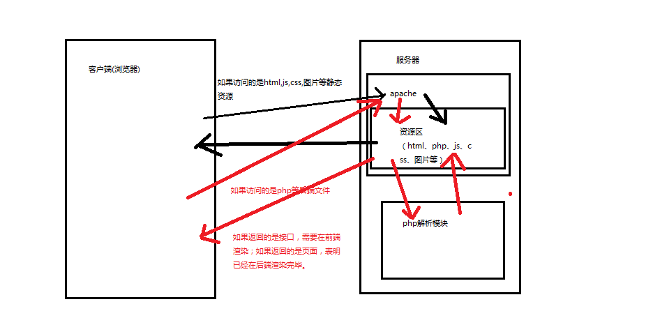

### 前端向后端请求数据示意图

### 前端渲染

- 我们在浏览器中通过url地址向服务器发送请求，如果请求的是html、图片、css、js等静态资源，服务器的apache直接返回给浏览器，由浏览器进行渲染。

- 如果在浏览器中通过url地址向服务器发送请求，如果是php等动态资源，如果这个php文件是完全独立的php标签，此时服务器中的apache将这个php文件发送给服务器中的php解析模块，解析成html页面可以识别的字符串后（可能是json形式的字符串、可能是html片断、或者是数值型、文本型）返回给apache，再由apache返回给浏览器。服务器返回这种形式的数据，称为后台接口。

  ~~~
   // 后台接口
      // echo 1;
      // echo 'Welcome to this';
      // header('Content-Type:text/html; charset=utf-8');
      // echo '
测试数据测试数据测试数据
';

      // json_encode() 把数组或者对象转换成字符串
      // $arr = array(123,456,789);
      // $arr = array("username"=>"张三","age"=>"12","sex"=>"male");
      // \u5f20\u4e09这种形式就是Unicode编码
      $arr = array();
      $arr['123'] = array("username"=>"zhangsan","chinese"=>"130");
      $arr['124'] = array("username"=>"lisi","chinese"=>"150");
      $arr['125'] = array("username"=>"wangwu","chinese"=>"120");
      $arr['126'] = array("username"=>"zhaoliu","chinese"=>"110");
      echo json_encode($arr);//{"username":"\u5f20\u4e09","age":"12","sex":"male"}
  ~~~

  ​

### 后端渲染

- 如果在浏览器中通过url地址向服务器发送请求，如果是php等动态资源，如果**这个php文件是html骨架标签中包含php标签的形式**，此时php解析器会将**此文件直接在后端进行渲染成html页面后返回给apache**，再由apache返回给浏览器。

  ~~~
  <!DOCTYPE html>
  <html lang="en">
  <head>
      <meta charset="UTF-8">
      <title>成绩</title>

  </head>
  <body>
      

          <?php 
          // 服务器端渲染页面
          $arr = array();
          $arr['123'] = array("username"=>"张三","chinese"=>"130","math"=>"149","english"=>"146","summary"=>"298");
          $arr['124'] = array("username"=>"李四","chinese"=>"100","math"=>"140","english"=>"136","summary"=>"298");
          $arr['125'] = array("username"=>"王五","chinese"=>"90","math"=>"139","english"=>"126","summary"=>"298");
          $arr['126'] = array("username"=>"赵六","chinese"=>"30","math"=>"50","english"=>"80","summary"=>"100");

          $code = $_POST['code'];

          if($code == 'admin'){
              foreach($arr as $value){
                  echo "<ul><li>姓名：$value[username]</li><li>语文：$value[chinese]</li><li>数学：$value[math]</li><li>英语：$value[english]</li><li>综合：$value[summary]</li></ul>";
              }
          }else{
              $score = $arr[$code];
              echo "<ul><li>姓名：$score[username]</li><li>语文：$score[chinese]</li><li>数学：$score[math]</li><li>英语：$score[english]</li><li>综合：$score[summary]</li></ul>";
          }
          
           ?>
      

  </body>
  </html>
  ~~~

  ​

### ajax与前端渲染

- 现在主流方式是根据ajax异步从后台获取接口，然后前端根据这些接口渲染到html页面上。

