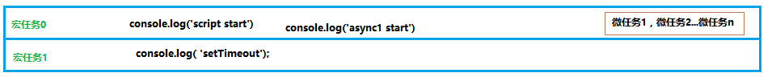
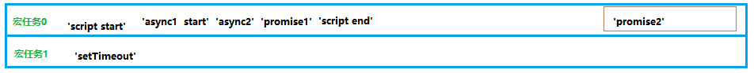
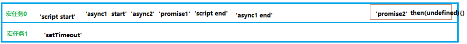

## JS线程进阶

- 根据我以前对JS线程的了解,我发现根本无法理解下面代码的打印顺序：

~~~javascript
setTimeout(function(){
     console.log('定时器开始啦')
 });
 
 new Promise(function(resolve){
     console.log('马上执行for循环啦');
     for(var i = 0; i < 10000; i++){
         i == 99 && resolve();
     }
 }).then(function(){
     console.log('执行then函数啦')
 });
 
 console.log('代码执行结束');
~~~

- 根据以前我的理解推论出来的顺序:

  ~~~
  马上执行for循环啦 --- 代码执行结束 --- 定时器开始啦 --- 执行then函数啦
  ~~~

- 但是真正的打印结果是：

  ~~~
  马上执行for循环啦--- 代码执行结束--- 执行then函数啦 --- 定时器开始啦
  ~~~

- 此时我发现我对JS引擎的执行机制有问题。事实上按照同步和异步的划分并不准确。

### JS任务的划分

- 在之前就是把js代码分成同步任务和异步任务，JS主线程执行代码时配到异步任务（定时器，http请求）去交给其他相应的辅助线程去执行（辅助线程执行完毕，会把结果放到消息队列），JS主线程会依次执行同步，当主线程的同步任务执行完毕后，去消息队列里面去查询是否有已经执行完毕的异步任务，然后再去放到主线程里面执行，然后再去查询。。。。。

- 其实准确的划分方式是:

  - macro-task(宏任务)：包括整体代码script，setTimeout，setInterval


  - micro-task(微任务)：Promise，process.nextTick

- 我们认为JS引擎在执行代码时，先开辟了一个宏任务0，在这里JS引擎碰到setTimeout，就开辟一个新的宏任务1，碰到 new Promise就执行里面的同步代码  console.log('马上执行for循环啦'),然后碰到.then 就在当前宏任务0中开辟一个附属的空间微任务0，继续向下碰到console.log('代码执行结束')直接执行。此时当前的宏任务0里面的同步代码已经执行完毕，此时JS引擎会去查找当前宏任务0里面的微任务，如果有依次执行（.then(执行then函数啦)）。此时宏任务0才真正的执行完毕。

- 因为我们开辟了宏任务1，所以JS引擎会在宏任务1里面去执行代码console.log('定时器开始啦')，此时所有代码执行完毕。

- 有价值的例子

### 有价值的例子

- 当我学习完ES7中的async和await之后，我又碰到了一个例子

~~~javascript
 async function async1() {
      console.log( 'async1 start');  //2
      await async2();
      console.log( 'async1 end');  ///7
 }
 async function async2() {
      console.log( 'async2');    //3
 }
 console.log( 'script start');   //1
 setTimeout(function() {
      console.log( 'setTimeout');  //8
 }, 0)
 async1();
 new Promise (function ( resolve ) {
      console.log( 'promise1');   //4
      resolve();
 }).then(function() {
      console.log( 'promise2');   //6
 })
 console.log( 'script end')   //5
~~~

- 执行结果

~~~javascript
// 结果为
 script start
 async1 start
 async2
 promise1
 script end
 promise2
 async1 end
 setTimeout
~~~

- 我们来分析一下JS引擎的执行过程

1. 首先函数 async1，async2不调用不执行所以,我们先不管 **直接打印同步代码 console.log('script start')**

开辟宏任务0，并且打印同步代码console.log('script start')。


2. JS引擎碰到setTimeout宏任务，开辟一个新的宏任务1


3. JS引擎碰到async1,带有async关键字的函数，不用害怕，它的仅仅是把return值包装成了promise，其他并没有什么不同的地方,所以就很普通的打印 `console.log('async1 start')`。



4. 此时最重要的分析：await,当代码执行到**await async2()**

- await，它**先计算出右侧的结果**，**然后看到await后，中断async函数**，让出当前线程。
- 先得到await右侧表达式的结果。执行 `async2()`，打印同步代码 `console.log('async2')`，并且return `Promise.resolve(undefined)`。
- await后，中断async函数，先执行async外的同步代码。
  目前就直接打印 `console.log('async2')`：


5. JS引擎碰到new Promise ，Promise构造函数是直接调用的同步代码，所以 `console.log('promise1')`


6. JS引擎碰到**promise.then()**，发现这个是微任务，所以暂时不打印，只是推入当前宏任务的微任务队列中。注意：**这里只是把promise2推入微任务队列，并没有执行**。**微任务会在当前宏任务的同步代码执行完毕，才会依次执行**


7. JS引擎碰到**console.log('script end'),** 直接打印。



8. 此时async外的代码终于走了一遍，JS引擎应该回到await 表达式那里，执行 `await Promise.resolve(undefined)` 了，这段代码怎么执行？根据 MDN 原话我们知道：如果一个 Promise 被传递给一个 await 操作符，**await 将等待 Promise 正常处理完成并返回其处理结果**。

- 在我们这个例子中，就是 `Promise.resolve(undefined)` 正常处理完成，并返回其处理结果。那么 `await async2()` 就算是执行结束了。
- 目前这个promise的状态是fulfilled，等其处理结果返回就可以执行await下面的代码了，那何时能拿到处理结果呢？
- 回忆平时我们用promise，调用resolve后，何时能拿到处理结果？是不是需要在then的第一个参数里，才能拿到结果。（**调用resolve时，会把then的参数推入微任务队列，等主线程空闲时，再调用它**）
- 所以Promise.resolve(undefined)代码就等价于Promise.resolve(undefined).then((undefined) => {});
- 把then的第一个回调参数 `(undefined)=>{}` 推入微任务队列。**then执行完，才是 `await async2()` 执行结束**。


9. 此时当前宏任务0主代码都执行完毕了，去执行当前宏任务里面的微任务。微任务队列，先进选出的原则：

- 执行微任务1，打印promise2
- 执行微任务2，没什么内容..

10.  但是微任务2执行后， `await async2()` 语句结束，后面的代码不再被阻塞，所以打印：



11. **宏任务1执行完成后，执行宏任务2**

- 宏任务2的执行比较简单，就是打印

```
console.log("setTimeout");
```
## js引擎与渲染GUI引擎如何调配
- js引擎宏任务--->微任务--->渲染页面--->宏任务。。。。 以此重复
