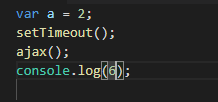
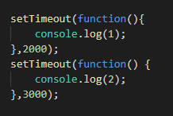
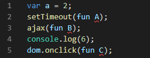

# 通俗易懂JS线程
## 进程和线程

### 进程

- 我们可以在电脑任务管理器里面查看正在运行的进程，可以认为一个进程就是一个正在运行的程序。
- 但是：比如打开3个网页就相当于开启了3个线程，我们目前只研究打开一个网页即一个进程的情况。
### 线程
一个进程的运行，当然需要很多线程的互相配合。
比如：打开QQ这个进程，就需要接收消息线程、传输文件线程、检测安全线程......，所以一个网页需要多个线程的配合。

## JS线程（主线程）

### js为什么是单线程

- js是单线程的，也就是说js代码只能在一个线程上运行。
- 因为：JS是主要是和用户交互以及操作DOM元素的，
- 设想：一段JS代码，分布到两个互不相关的进程上运行，一个添加DOM，一个删除DOM，以哪个为准呢？为了避免复杂性，JS从一开始就是单线程的。

### 浏览器或者node中的线程（辅助线程）

- JS是单线程的，那么诸如onclick回调、setTimeout、Ajax是如何怎么实现的。
- 是因为浏览器或者node（宿主环境）是多线程的，即浏览器有几个线程去辅助JS线程的运行。
- 把主要的线程简单说明一下。

####类别A：GUI渲染线程

####类别B：JS引擎线程

####类别C：EventLoop轮询处理线程

####类别D：其他线程

#####定时器触发线程

#####http异步线程（主要是ajax）

#####浏览器事件线程

####辅助线程的作用

1.执行主线程丢过来的异步代码，并执行代码

2.保存着回调函数，异步代码执行成功后，通知EventLoop线程过来取相应的回调函数

####注意

类别A和类别B是互斥的，js语言设定js引擎与GUI引擎是互斥的，也就是说GUI引擎在渲染时会阻塞js引擎计算。
因为：如果GUI引擎在渲染时，js改变了DOM，就会造成渲染不同步。

## JS代码执行时，多个线程是如何配合工作的

### 主进程分析

1.第一行和第四行代码是同步代码，直接在主线程中运行

主线程在运行JS代码时，会生成一个执行栈，可以处理函数的嵌套，通过进栈出栈这样的方式。

2.第二行和第三行代码交给其他线程处理

### 消息队列（事件队列）event queue

- 简单理解为一个静态的队列存储结构，非线程，只做存储，里面存储的是一堆异步成功后的回调函数。
队列先进先出。

- 注意：是异步成功后，才把其回调函数扔进消息队列，而不是一开始就把所有异步的回调函数扔进对列。
比如：setTimeOut3秒后才执行一个函数，那么这个函数是在3秒后才进队列的。

#### 举例说明

- 主线程在碰到定时2s的定时器时将其丢给定时器触发线程执行，在碰到3s的定时器时将其丢给定时器触发线程执行。
在一开始，消息队列是空的，在2秒后，一个 () => { console.log(1) } 的函数进入队列，在（2s的基础上）3秒后，一个 () => { console.log(2) }的函数进入队列，此时队列里有两个元素，主线程从队列头中挨个取出并执行。

###D类进程分析

- JS碰到异步代码，就会被放到相应的线程中去执行

- 主线程碰到 2 setTime时，把这段代码交给定时器触发线程去执行

- 主线程碰到3 ajax时，把这段代码交给http异步线程去执行

- 主线程碰到 5 onclick时，把这段代码交给浏览器事件线程去执行

- 注意:这个几个异步代码的回调函数，会在各自的线程中保存着，因为需要在未来执行。。。

###B类线程的作用

- B类线程主要负责：主线程、消息队列、	D类进程之间的相互交流。

### 综合分析

#### 图解

-----

-----

-----

-----
#### 注意事项
注意：
1. 对于setTimeOut代码，定时器触发线程在接收到代码时就开始计时，时间到了将回调函数扔进队列。

2. 对于ajax代码，http异步进程立即发起http请求，请求成功后才将回调函数扔进队列。

3. 对于dom.onclick，浏览器事件线程会监听dom，直到dom被点击了，才将回调函数扔进队列。

注意：
- 图里的队列里都只有一个回调函数，实际上有很多个回调函数，如果主线程里执行的代码复杂需要很长时间，这时队列里的函数们就排着，等着主线程啥时执行完，再来队列里取所以从这里能看出来，对于setTimeout，setInterval的定时，不一定完全按照设想的时间的，因为主线程里的代码可能复杂到执行很久，所以会发生你定时3秒后执行，实际上是3.5秒后执行（主线程花费了0.5秒）。

