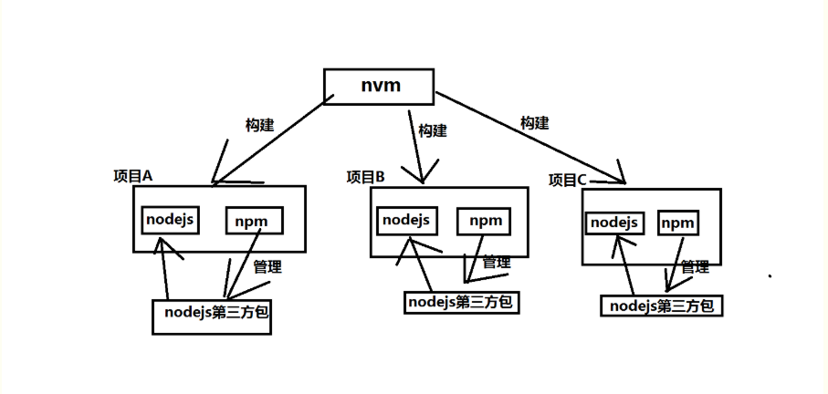

### nodejs简介

- nodejs是基于事件的，很多api都是基于事件完成的。
- nodejs是阻塞式的，也就是说当我们想让nodejs为我们提供某种服务式，它就一直停留在这个服务模式，我们一旦关闭，这个服务就中止了。

### nodejs的用途

- 像 PHP 一样，使用 Javascript 编写符合规范的**后端 API 接口** 或 **网站**
- 使用 Node.js 开发一些**实用的工具** 或 **包**
- 基于 Socket 技术，开发类似于聊天室之类的**即时通讯项目**
- 基于 Electron 环境，开发**桌面软件**
- ect...

### nvm多版本管理工具 （node version manger）

- 我们如果需要切换版本进行新特性测试时，需要使用第三方的版本管理工具nvm。
- 多版本按照方式：
  - 卸载已有的Node.js
  - 下载nvm
  - 在C盘创建目录环境dev，创建两个子目录nvm和nodejs，并把nvm包解压进去
    - 以管理员身份运行install.cmd 打开CMD窗口，直接回车生成一个配置文件settings.txt
    - 把配置文件存到当前目录中
    - 修改配置文件内容把root 设置为nvm文件夹的路径，把path改为nodejs文件夹的路径
  - 配置nvm和node.js环境变量 在CMD中打开sysdm.cpl
    - 配置变量名为NVM_HOME，变量值为C:\dev\nvm   	nvm文件夹路径
    - 配置变量名为NVM_SYMLINK，变量值为C:\dev\nodejs  nodejs文件夹路径
#### nvm的常用命令

- nvm list 查看当前安装的Node.js所有版本
- nvm install 版本号，安装指定版本的Node.js
- nvm uninstall 版本号，卸载指定版本的Node.js
- nvm use 版本号，选择指定版本的Node.js
- nvm -v 查看当前使用的node版本
### 如何运行node
所谓node就是把谷歌浏览器的v8内核，抠出来。
- 命令行方式REPL
  REPL---Read-eval-print-loop read读取代码，eval运算代码，print打印代码、loop循环整个过程
  我们可以像在谷歌浏览器console面板里面运行js代码一样，在node里面运行代码
  直接在cmd窗口中输入node回车进行环境，然后就可以运行js代码了。
  我们称这样的方式为命令行方式REPL
  在console面板中 直接输入算术运算 如 1+1 ，回车直接输出结果为2，在REPL中也有这个特性
  在REPL中下划线 _ 代表最后一次执行结果,console中没有这个特性
  .exit 可以退出REPL环境
  我们还可以在CMD中通过dos命令进入到指定的文件夹，假设这个文件夹中有个.js文件，我们就可以 node 文件名 ，就可以执行这个文件。
### 如何运行node中的js文件

- 可以直接在命令行工具中输入 node  文件名 ，如果不在同一路径需要加上路径。

### nodejs中的api
- 就像浏览器为js提供了许多api一样，如window，location，nevigator等，nodejs也为js提供了许多api，我们需要逐步学习它们。
### nodejs中路径问题

- 在HTML和CSS中，相对路径是指相对于当前文件的路径。

- 在nodejs中相对路径是相对于node终端运行的环境，而不是相对于运行的js文件。

- 通常会在（文件读取时）这种情况下出现问题。

  ~~~
  我们在文件操作中需要写相对路径找到文件。
  我们认为文件中的相对路径，是相对于这个这个文件而言的。其实是相对于node终端运行的环境。
  比如文件目录结构如下：aa>ddd,ss 其中ddd>hhh,test.js
  同时还有一个文件夹mm与aa是同一级
  现在我们在mm中打开终端，然后再mm这个终端下 根据相对路径去运行 test.js文件。这个文件会去读取hhh里面的内容。虽然路径是正确的，但是由于我们终端的运行环境是在mm下，那么在mm下去运行这个test.js文件，这个文件中的相对路径，就变成了相对于mm这个目录。
  -----------------------------------------------------
  有两种解诀方式：
  1.就是通过dos命令修改终端运行环境，让终端的运行环境与js文件的目录一致。
  2.就是在js文件中通过__dirname获取当前文件的绝对路径，然后再去拼接要操作文件的路径。（最好用path.join（）拼接路径）.
  我们推荐用第二种，是标准化的方式。
  ~~~

- 我们大部分情况，都希望相对路径是相对于文件而言，所以我们使用全局变量__dirname,然后去拼接字符串。

  这样我们不管在哪个终端执行环境都可以正确执行文件。

#### Global
Global对象相当于浏览器的window对象，里面有许多属性和方法
- 属性
  - __filename:文件名称全路径
  - __dirname:文件目录路径（绝对路径）是当前运行的js文件在系统中的绝对路径
  - process:是一个对象，这个对象有许多属性和方法，我们简单学习一个
    - process.argv 默认情况下是一个数组，前两项数据分别是：nodejs的环境的路径，当前执行的js文件的路径，从第三个参数开始就是命令行的参数。作用接收命令行的参数。
    - process.arch :当前操作系统的架构（位数，32位：x64，64位：x86）
- 方法
  - setInterval(callback, delay[, ...args])
  - clearInterval(intervalObject)
  - setTimeout(callback, delay[, ...args])
  - clearTimeout(timeoutObject)
  - 先了解这些
### 模块化开发

- 模块化就是一种明文规定，规范。
- 为什么要有模块化：**为了解决文件之间的依赖关系**；
- 注意：**模块化是一种开发思想**；具体开发中需要定制符合实际需求的**模块化规范**！
- 大家可以把模块化规范，认为是一种**明文的约定**，大家都按照相同的约定写代码，减少了不必要的沟通成本，极大方便了各个模块之间的调用，方便别人，同时也方便自己；

- 与模块化开发对应三个非常重要的属性，分别是exports、module、require()。
-  模块化开发
    传统非模块化开发有如下的缺点：
    1、命名冲突
    2、文件依赖：在前端中引入文件经常是有顺序的，而且会出现文件多重嵌套，非常麻烦
    - 前端标准的模块化规范：
      1、AMD - requirejs
      2、CMD - seajs
    - 服务器端的模块化规范：
      1、CommonJS - Node.js
    - 作用：是一套 Javascript 的模块化规范，规定了 **模块的特性** 和 **各模块之间如何相互依赖**；
    - 用途：Node.js 中使用了 CommonJS 规范；
    - 特点：同步加载模块；不适合在浏览器端使用；
    - CommonJS规范都定义了哪些内容：[wiki 对于 Modules 的描述](http://wiki.commonjs.org/wiki/Modules/1.1)

    模块化相关的规则：
    1、如何定义模块：一个js文件就是一个模块，模块内部的成员都是相互独立
    2、模块成员的导出和引入
    3、我们需要特别注意：模块化是完全独立的，即使是全局变量也是在模块里面独立的互不影响。
    4、模块文件的后缀3种情况：.js .json .node
    上述三种模块的加载优先级(当文件名相同只是后缀不同且引入时不加文件后缀时的优先级)：.js -> .json -> .node
- 导出模块成员
   默认其情况下模块内部成员都是独立的，如果我们需要在一个模块中引入另一个模块中的成员，我们需要将模块公开出去即导出
   - 导出模块成员有两种方式  与之对应是两种引入方式
   1. exports.属性名 = 属性值（如：对象，函数，变量); 
   2. module.exports = 属性值（如：对象，函数，变量）;
   3. 通过global全局变量，给其添加属性。global.属性名 = 属性值（如：对象，函数，变量）。
- 引入模块成员 
   我们可以把公开模块成员引入到需要的模块中，如果公开的模块中有console输出的话，那么在运行引入模块的模块时也会把公开模块的console输出进行输出。
       1. 如果是第一种公开方式， require("公开成员的模块路径")这个方法会返回一个对象，公开的成员会作为这个对象的成员，所以我们需要用对象.属性的方法来调用。
       2. 如果是第二种公开方式，require("公开成员的模块路径")会直接返回这个公开成员，所以我们可以直接接收、调用。
       3. 对于第三种公开方式，require("公开成员的模块路径")没有返回值，我们可以直接global.属性进行调用。
         **注意**：已被加载的模块会进行缓存。
- 其它模块文件-json
  json模块是存粹提供数据的，所以我们不需要将json模块公开，直接在需要的模块中引入即可
- 模块分类
   - 自定义模块
   - 系统核心模块
      - fs 文件操作
      - http 网络操作
      - path 路径操作
      - querystring 查询参数解析
      - url url解析
      - ......
#### 模块作用域

1. **module（模块标识）**

   module 属性是 Common JS 规范中定义的，它是一个对象，表示当前这个具体的 js 模块；是一个对象。

2. **require（引用模块）**

   每一个实现了 CommonJS 规范的模块，必须定义一个 require() 函数，使用这个 require 函数，就能够 很方便的导入其它 模块中的成员，供自己使用；是module里面的属性。

3. **exports（暴露模块成员）**

   每一个模块中，如果想要把自己的一些私有成员，暴露给别人使用，那么，必须实现一个 exports 对象，通过exports对象，可以方便的把模块内私有的成员，暴露给外界使用；是module里面的属性，默认是一个空对象。

#### module.exports 和 exports 的关系

1. `module.exports` 和 `exports` 默认引用了同一个空对象；
2. `module.exports` 和 `exports` 作用一致，都可以向外暴露成员；
3. 一个模块作用域中，向外暴露私有成员时，永远以 `module.exports` 为准；

### Buffer基本操作
- Buffer不是一个模块，而是全局对象global里面的成员
- Buffer就是用来处理二进制数据的
- Buffer本质上就是字节组成的数组，二进制基本单位是b,8个b就是一个B(字节)
- Buffer里面的api可以分为3类：构造方法（类）、静态方法、实例方法。
#### 实例化buf对象
- 我们可以new一个Buffer，根据传入参数的不同，返回的结果也不同
- 直接传入数字，返回指定字节数量的Buffer以16进制的表现形式，但是不推荐使用。
- 实例化Buffe已经被废弃了，不推荐使用。
~~~javascript
// let buf = new Buffer(5);
// let buf = Buffer.alloc(5); //我们推荐用这个  
// console.log(buf);  //<Buffer 00 00 00 00 00> 相等于5个字节，表现形式是16进制

//我们还可以传入一个要生二进制字节的字符串，还可以指定编码方式。
// let buf = Buffer.from('hello','utf8');
// console.log(buf);  //<Buffer 68 65 6c 6c 6f> 我们就拿到了hello字符的16进制的表现形式

//我们还可以传入一个16进制的数组
// let buf = Buffer.from([0x62, 0x75, 0x66, 0x66, 0x65, 0x72]);
// console.log(buf.toString());
~~~
#### buf静态方法
~~~javascript
//判断Buffer是否支持某种编码
// console.log(Buffer.isEncoding('utf8'));
// console.log(Buffer.isEncoding('gbk'));

//判断一个对象是否是buffer对象
// let buf = Buffer.from('hello');
// console.log(Buffer.isBuffer(buf));
// console.log(Buffer.isBuffer({}));

//获取buffer对象的字节长度，根据buffer对象的编码方式不同会有所不同，像utf-8,一个汉字3个字节，一个英文字母一个字节，ascii一个汉字1个字节。
// let buf = Buffer.from("中国","utf-8");
// console.log(buf);
// console.log(Buffer.byteLength(buf));  // 6

//注意ascii码无法表示汉字，所以虽然可以成功获取相应字节，但是肯定不是 我们想要的结果
//let buf = Buffer.from("中国","ascii");
//console.log(buf);
//console.log(Buffer.byteLength(buf));  // 2
// console.log(buf.toString())  //会出现乱码

//拼接buffer，把多个buffer拼接成一个，参数必须是数组形式
// let buf1 = Buffer.alloc(3);
// let buf2 = Buffer.alloc(5);
// let buf3 = Buffer.concat([buf1,buf2]);
// console.log(Buffer.byteLength(buf3));

// let buf1 = Buffer.from('tom');
// let buf2 = Buffer.from('jerry');
// let buf3 = Buffer.concat([buf1,buf2]);
// console.log(Buffer.byteLength(buf3));
// console.log(buf3.toString());
~~~
#### buf实例方法
- write() 向buf中写入内容
~~~
// let buf = Buffer.alloc(5);
//write() 第一个参数类型是字符串，剩下的参数是可选的，第二个是offset（偏移）、第三个是length（长度）
// buf.write('hello',2,2);
// console.log(buf);
~~~
- slice() 截取新的buf对象。 返回截取新的buf对象 有两个参数 （数值型）start 和 end ，都不写默认截取全部，不写end那么end就是buf.length;
~~~
let buf = Buffer.from("hello");
let buf1 = buf.slice(2);
console.log(buf == buf1);
console.log(buf1.toString());
~~~
- toString() 把buf对象转换为字符串
- toJSON() 把buf对象转换为json格式的字符串
  在使用JSON.stringify()时如果传入一个buf对象，那么会自动的调用buf的toJSON方法。
  toJSON方法不需要显式调用，当JSON.stringify方法调用的时候会自动调用toJSON方法.
~~~
// const buf = Buffer.from([0x1, 0x2, 0x3, 0x4, 0x5]);
const buf = Buffer.from('hello');
const json = JSON.stringify(buf);
console.log(json);
~~~
### nvm、npm、nodejs的关系
reactNative的项目构建都是有这几个工具进行构建管理。

掌握他们的关系，就能了解reactNative项目是如何进行模块化构建的。

nvm:nodeJs版本管理工具,管理nodejs版本和npm版本

nodeJs: reactNative开发过程中所需要的代码库。

npm:是随同nodeJs一起安装的包管理工具，npm管理对应nodeJs的第三方插件

   常见的使用场景有以下几种：

   . 允许用户从npm服务器下载别人编写好的第三方包到本地使用（例如淘宝服务器）

   . 允许用户将自己编写的包上传到NPM服务器供别人使(例如自己搭建的npm服务器)

nvm、nodejs、npm的关系：

   (1)nvm管理构建nodejs和对应的npm,npm管理对应nodejs的第三方插件

　(2)一个reactNative项目只包含一个nodejs和npm,npm和nodejs是配套关系，

      一对一的关系。
nvm构建reactNavite的关系图：

### 路径模块（path）
- 路径模块主要作用就是处理 不同操作系统的路径语法不一样的问题，如linux操作系统文件路径统一是/，windows操作系统是盘符和\
- 引入路径模块- 
  不论在哪个模块中引入路径模块，其路径都是一样的。
  const path = require('path');
#### path.basename 获取路径的最后一部分（文件名）
- 该方法有第二个参数，**为文件的后缀**，这样我们就可以只获取文件名
  这些路径是linux系统的路径，如果为windows带盘符
   console.log(path.basename('/foo/bar/baz/asdf/quux.html'));
   console.log(path.basename('/foo/bar/baz/asdf/quux.html', '.html'));
#### path.dirname 获取路径
~~~javascript
// console.log(__dirname); //获取当前路径
//不管加不加后缀，最后一个字段都认为是文件，所以获取不到
// console.log(path.dirname('/abc/qqq/www/abc')); //获取指定的路径
// console.log(path.dirname('/abc/qqq/www/abc.txt')); 
~~~
#### path.resolve 

- 可以把当前相对路径解析为绝对路径。

#### path.extname 获取扩展名称

console.log(path.extname('index.html'));
#### 路径的格式化处理
- path.format() obj->string
~~~javascript
// let objpath = {
//     root : 'd:\\',
//     dir : 'd:\\qqq\\www',
//     base : 'abc.txt',
//     ext : '.txt',
//     name : 'abc'
// };
// let strpath = path.format(objpath);
// console.log(strpath);
~~~
- path.parse()  string->obj
~~~javascript
// let obj = path.parse(__filename);
// console.log(obj);

{ root: 'E:\\', 文件的跟路径
  dir: 'E:\\node\\day02\\02-code',文件的全路径
  base: '02.js',文件的名称
  ext: '.js',扩展名
  name: '02' 文件名称
}
~~~
#### 判断是否为绝对路径 path.isAbsolute
- 在window中有盘符的是绝对路径，在linux中以 / 开始的为绝对路径
~~~javascript
// console.log(path.isAbsolute('/foo/bar'));
// console.log(path.isAbsolute('C:/foo/..'));
~~~
#### ptah.join() 拼接路径
会解析特殊字符，（..表示上层路径；. 表示当前路径；\ 表示转义）
~~~
// 拼接路径（..表示上层路径；.表示当前路径）,在连接路径的时候会格式化路径。
// console.log(path.join('/foo', 'bar', 'baz/asdf', 'quux', '../../'));
~~~
#### 规范化路径 path.normalize  

会把不符合路径规范的字符串进行规范化。
~~~
// console.log(path.normalize('/foo/bar//baz/asdf/quux/..'));
// console.log(path.normalize('C:\\temp\\\\foo\\bar\\..\\'));
~~~
#### 计算相对路径 path.relative(from,to)
可以计算出两个路径之间的相对路径
~~~
// console.log(path.relative('/data/orandea/test/aaa', '/data/orandea/impl/bbb'));
// console.log(path.relative('C:\\orandea\\test\\aaa', 'C:\\orandea\\impl\\bbb'));
~~~
#### 解析路径 path.resolve()

 方法将路径或路径片段的序列解析为绝对路径。

给定的路径序列从右到左进行处理，每个后续的 `path` 前置，直到构造出一个绝对路径。 例如，给定的路径片段序列：`/foo`、 `/bar`、 `baz`，调用 `path.resolve('/foo', '/bar', 'baz')` 将返回 `/bar/baz`。

如果在处理完所有给定的 `path` 片段之后还未生成绝对路径，则再加上当前工作目录。

生成的路径已规范化，并且除非将路径解析为根目录，否则将删除尾部斜杠。

零长度的 `path` 片段会被忽略。

如果没有传入 `path` 片段，则 `path.resolve()` 将返回当前工作目录的绝对路径。

~~~
console.log(path.resolve('wwwroot', 'static_files/png/', '../gif/image.gif'));
~~~
####  两个特殊属性   
console.log(path.delimiter);//表示当前操作系统的变量分隔符。(windows中使用; linux中使用:)
console.log(path.sep);//环境当前操作系统的路径分隔符。（windows是\ Linux是/）

### 文件模块
- 使用文件模块需要引入该模块  const fs = require('fs');
- 在文件模块中有很多api，并且大部分api有异步和同步两个版本，同步的标识是sync
#### 异步I/O input/output
- 在node中常用到异步I/O有两个场景：
  1、文件操作
  2、网络操作
- 就像在浏览器中js的多线程一样，主线程与其他线程是异步运行的。
#### 文件信息获取 stat
~~~
let file = require("fs");
//一般回调函数的第一个参数是错误对象 err,如果err为null,表示没有错误，否则表示报错了。
//第二个参数为一个对象，提供了一个属性和方法
file.stat("./data.txt",(err,stat)=>{
    console.log(err);
    if(err) return;
    if(stat.isFile()){
        console.log("文件");
    }
    if(stat.isDirectory()){
        console.log("目录");
    }
    //stat还有一些其他的属性
    //atime  访问的时间
    //ctime  表明上次更改文件状态的时间戳（如文件的权限)
    //mtime  文件数据发送生变化的时间
    //brithtime 文件创建的时间
});

-------------------
statSync 同步操作
注意同步操作会影响主线程上代码的执行，因为文件操作属于耗时操作。
// let ret = fs.statSync('./data.txt');
// console.log(ret);
~~~
#### 文件的读取 readFile
fs.readFile(file[,options,]callback)
~~~
const fs = require('fs');
const path = require('path');
let strpath = path.join(__dirname,'data.txt');
//data就是读取到文件的数据
// fs.readFile(strpath,(err,data)=>{
//     if(err) return;
//     console.log(data.toString());
// });

// 如果有第二个参数并且是编码，那么回调函数获取到的数据就是字符串
// 如果没有第二个参数，那么得到的就是Buffer实例对象
// fs.readFile(strpath,'utf8',(err,data)=>{
//     if(err) return;
//     // console.log(data.toString());
//     console.log(data);
// });
------------------------
//同步操作
let ret = fs.readFileSync(strpath,'utf8');
console.log(ret);
~~~
#### 文件的写入 fs.writeFile
- fs.writeFile(file, data[, options], callback)
- 如果没有指定的文件，那么会创建这个文件在执行写入。
- file <string> | <Buffer> | <URL> | <integer> 文件名或文件描述符。
- data <string> | <Buffer> | <TypedArray> | <DataView>
- options <Object> | <string>
  - encoding <string> | <null> 默认值: 'utf8'。
  - mode <integer> 默认值: 0o666。
  - flag <string> 参阅支持的文件系统标志。默认值: 'w'。
- callback <Function>
  - err <Error>
    异步地将数据写入到一个文件，如果文件已存在则覆盖该文件。 data 可以是字符串或 buffer。
    如果 data 是一个 buffer，则 encoding 选项会被忽略。
~~~
const fs = require('fs');
const path = require('path');
let buf = Buffer.from('hi');
fs.writeFile(strpath,buf,'utf8',(err)=>{
    if(!err){
        console.log('文件写入成功');
    }
});
~~~
如果 options 是一个字符串，则它指定字符编码：
~~~
注意：如果err为空，则表示操作失败
let strpath = path.join(__dirname,'data.txt');
fs.writeFile(strpath,'hello nihao','utf8',(err)=>{
    if(!err){
        console.log('文件写入成功');
    }
});
~~~
#### 文件的追加操作
- 语法:fs.appendFile(path, data[, options], callback)
- 参数说明：path <string> | <Buffer> | <URL> | <number> 文件名或文件描述符。
- data <string> | <Buffer>
- options <Object> | <string>
    encoding <string> | <null> 默认值: 'utf8'。
    mode <integer> 默认值: 0o666。
    flag <string> 参阅支持的文件系统标志。默认值: 'a'。
- callback <Function>
  异步地将数据追加到文件，如果文件尚不存在则创建该文件。data可以是字符串或Buffer。
  err <Error>
### 文件的复制操作

- 语法：fs.copyFile(src, dest[, flags], callback)
- 参数：src源文件路径 dest目标文件路径   flags数字型用于拷贝操作的修饰符。**默认值:** 0。callback参数err对象。
- 将源文件复制到指定的文件路径，如果没有需要创建，再进行复制。如果已经存在目标路径，那么会将原有内容覆盖。

#### 文件的流式操作
- 以上文件的读取操作都是把数据全部读取到内存中，然后再从内存中写入到指定的目录，当文件过大时会严重影响耗用内存
- 流的概念，是指数据的操作形式，向水流一样,在计算机中就是把数据从磁盘写入到内存叫读取流，从内存写入到硬盘叫写入流。
- node中提供了两个文件流式操作的api，每次读取一块数据像水流一样不停的读取。先把数据块通过内存中，然后再把数据块写入到硬盘中，不停的重复执行。
##### fs.createReadStream 产生读取文件流
- fs.createReadStream(path[, options])
- 返回一个对象，可以监听读取文件的过程
##### fs.createWriteStream 产生写入文件流
- fs.createWriteStream(path[, options])
- 返回一个对象，里面有一些方法可以写入数据如wirte
##### node中文件流事件
- on，在文件读取流中可以通过on监听事件。常用有data（当开始读取一部分文件时触发）和end（当文件读取完毕时触发）
- 由于是流操作，每次读取一块数据，所以我们需要不停的读取直到读取完毕。
- on事件有固定的语法格式
~~~
const path = require("path");
const fs = require("fs");
let spath = path.join(__dirname,'../03-source','file.zip');
let dpath = path.join('C:\\Users\\www\\Desktop','file.zip');
//必须参数为路径
let readStream = fs.createReadStream(spath);
let writeStream = fs.crearWriteStream(dpath);
--------------------
//第一个参数必须是 "data"---事件名当文件开始读取一部分时触发,回调函数中的参数是chunk 块的意思
// let num = 1;  这个变量纪录数据块写入的次数
readStream.on('data',(chunk)=>{
     num++;
     //当读取到数据块时，直接通过写入流进行写入
     writeStream.write(chunk);
});
//此外还有一个事件参数 end，就是文件文件读取完毕时触发
readStream.on('end',()=>{
     console.log('文件处理完成'+num);
     //我们可以查看写入块的次数
});
~~~
- 我们还可以利用文件流中的一个方法，pipe() 管道的意思，把读取流与写入流像管道一样连接起来，可以直接完成文件的读写操作。
  readStream.pipe(writeStream);
  //简洁的写法
  fs.createReadStream(spath).pipe(fs.createWriteStream(dpath));
### 目录模块

- 操作目录的api也是文件模块中提供的

- 该模块中的api也有同步和异步之分。
#### 创建目录 fs.mkdir(path[, mode], callback)
~~~
const path = require('path');
const fs = require('fs');
// 创建目录
fs.mkdir(path.join(__dirname,'abc'),(err)=>{
    console.log(err);
});
-----------------
// fs.mkdirSync(path.join(__dirname,'hello'));
~~~
#### 读取目录 fs.readdir(path[, options], callback)

- 也就是获取目录信息。
- 读取目录时，我们基本就是去操作目录中的文件，所以回调函数的第二个参数是目录中子文件数组（包括子文件夹）
- 我们可以去操作目录中的文件数组。

~~~
// 读取目录
// fs.readdir(__dirname,(err,files)=>{
//     files.forEach((item,index)=>{
//         fs.stat(path.join(__dirname,item),(err,stat)=>{
//             if(stat.isFile()){
//                 console.log(item,'文件');
//             }else if(stat.isDirectory()){
//                 console.log(item,'目录');
//             }
//         });
//     });
// });
-----------------------
// let files = fs.readdirSync(__dirname);
// files.forEach((item,index)=>{
//     fs.stat(path.join(__dirname,item),(err,stat)=>{
//         if(stat.isFile()){
//             console.log(item,'文件');
//         }else if(stat.isDirectory()){
//             console.log(item,'目录');
//         }
//     });
~~~
#### 删除目录 fs.rmdir(path, callback)

- 如果目录中不为空，无法删除。

~~~
// fs.rmdir(path.join(__dirname,'abc'),(err)=>{
//     console.log(err);
// });

fs.rmdirSync(path.join(__dirname,'qqq'));
~~~

